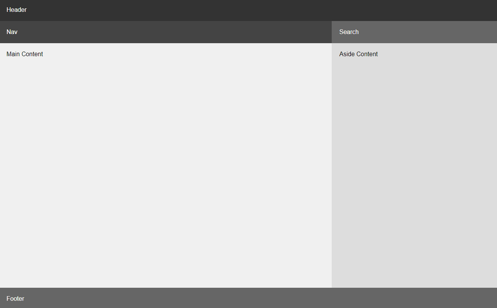
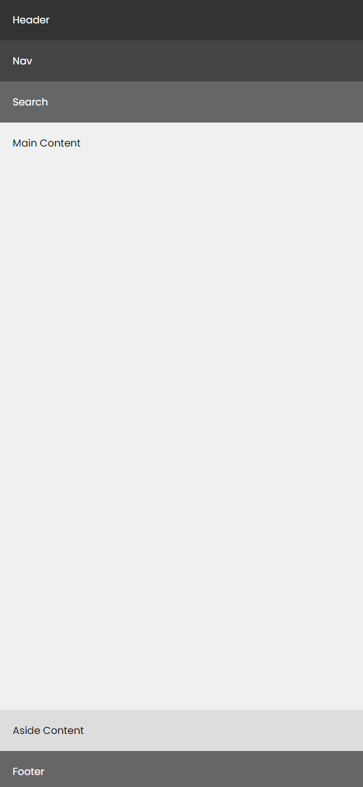

# Responsive Grid

Making your grids responsive is just as easy as making your text responsive. You can use media queries to change the grid layout based on the screen size. We are going to make the grid from the previous challenge responsive.

Here is the HTML:

```html
<div class="container">
  <header>Header</header>
  <nav>Nav</nav>
  <div class="search">Search</div>
  <main>Main Content</main>
  <aside>Aside Content</aside>
  <footer>Footer</footer>
</div>
```

Here is the CSS:

```css
* {
  margin: 0;
  padding: 0;
  box-sizing: border-box;
}

body {
  font-family: Arial, sans-serif;
}

.container {
  display: grid;
  grid-template-columns: 2fr 1fr;
  grid-template-rows: auto auto 1fr auto;
  min-height: 100vh;
}

header {
  background-color: #333;
  color: #fff;
  padding: 20px;
  grid-column: span 2;
}

nav {
  background-color: #444;
  color: #fff;
  padding: 20px;
}

.search {
  background-color: #666;
  color: #fff;
  padding: 20px;
  grid-row: span 1;
}

main {
  background-color: #f0f0f0;
  padding: 20px;
}

aside {
  background-color: #ddd;
  padding: 20px;
}

footer {
  background-color: #666;
  color: #fff;
  padding: 20px;
  grid-column: span 2;
}
```

It looks like this:



We want it to stack on small screens under 768px. We can do this by adding a media query to the CSS.

First off, we know we want one single column on small screens. So we can set the `grid-template-columns` to `1fr` in the media query.

```css
@media (max-width: 768px) {
  .container {
    grid-template-columns: 1fr;
  }
}
```

If you are not doing any spans, this is really the only thing that you need to do. If you are doing spans, you will need to adjust the spans in the media query as well.

We have the header and footer spanning 2 columns. We need to adjust this in the media query.

```css
@media (max-width: 768px) {
  .container {
    grid-template-columns: 1fr;
  }

  header {
    grid-column: span 1;
  }

  footer {
    grid-column: span 1;
  }
}
```

Now everything is stacked on top of each other on small screens. However, the search is now set to the 1fr row because it is now in the 3rd column. We need to adjust this as well.

```css
@media (max-width: 768px) {
  .container {
    grid-template-columns: 1fr;
    grid-template-rows: auto auto auto 1fr;
    grid-auto-rows: auto;
  }

  header {
    grid-column: span 1;
  }

  footer {
    grid-column: span 1;
  }
}
```

Now the main content is the 1fr row and the search is the 3rd row. Everything is stacked on top of each other on small screens.


