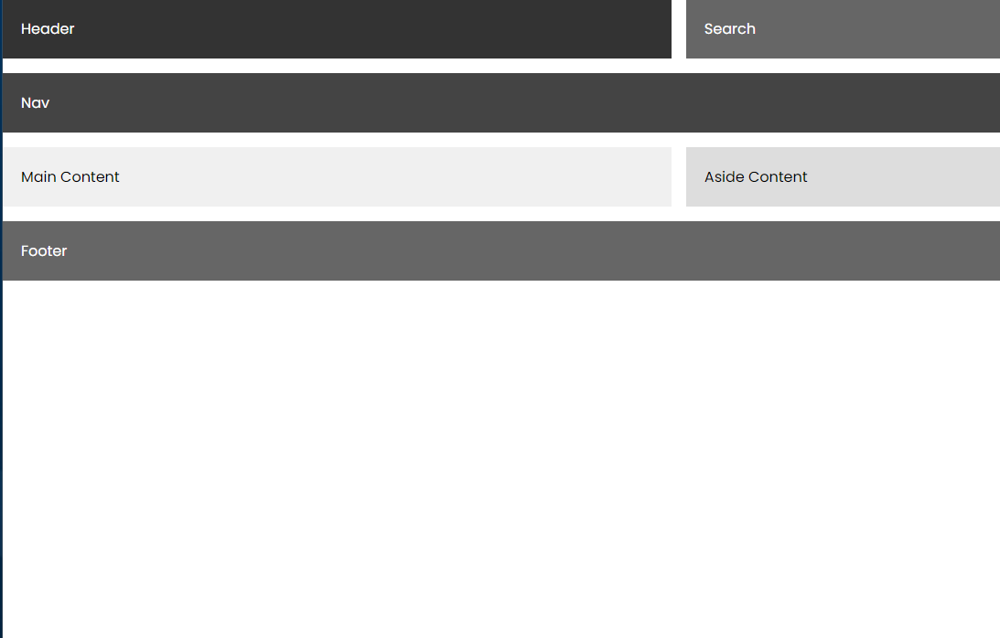
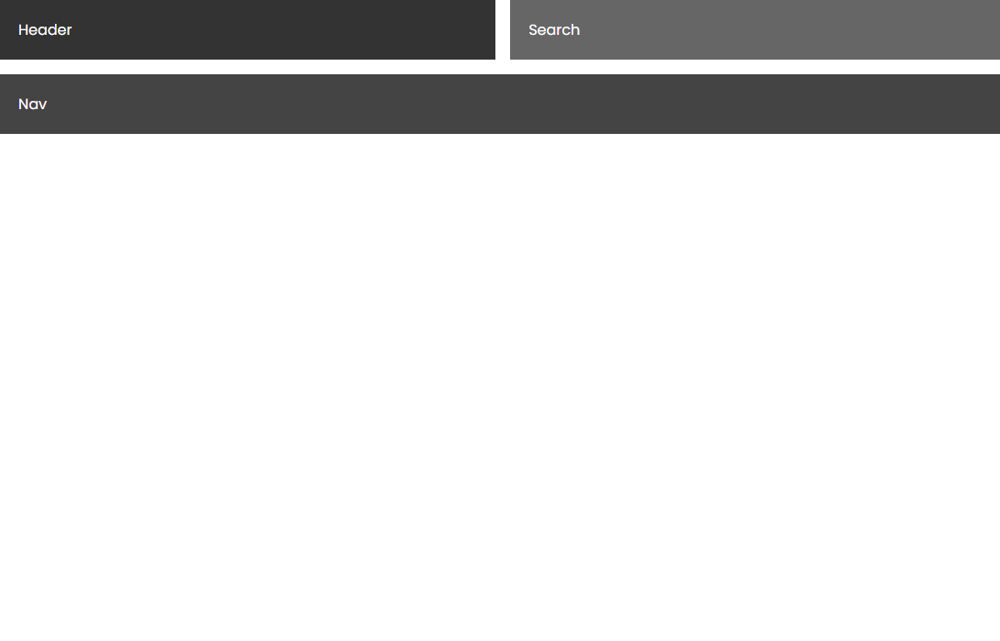
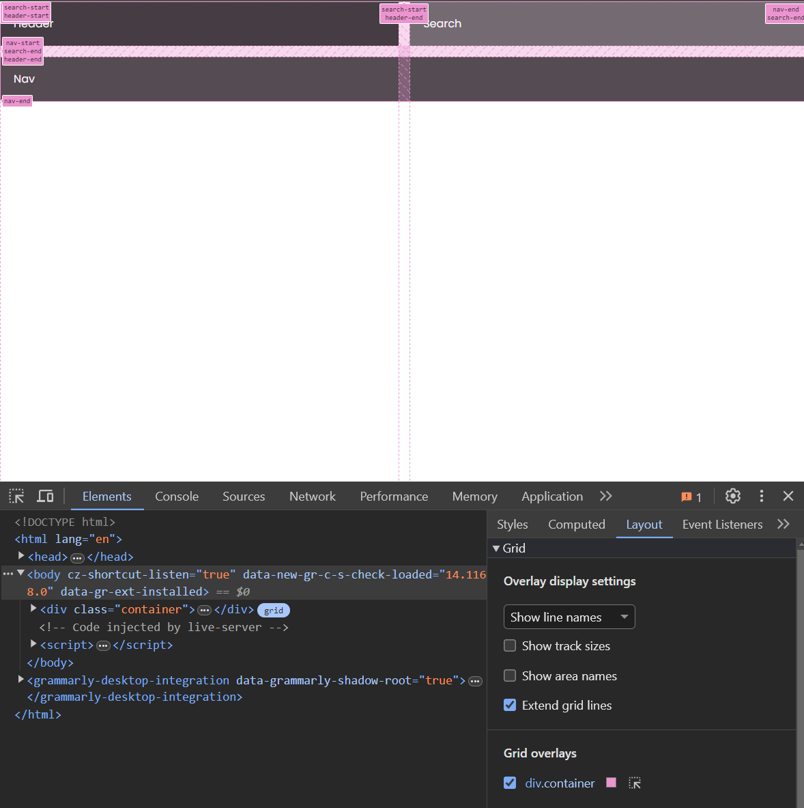
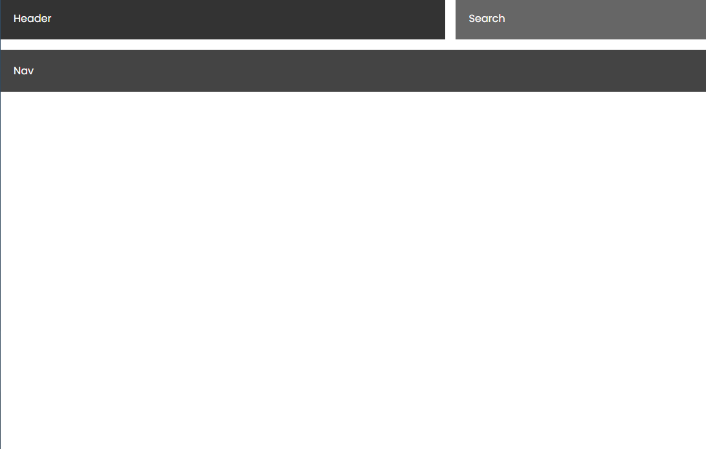
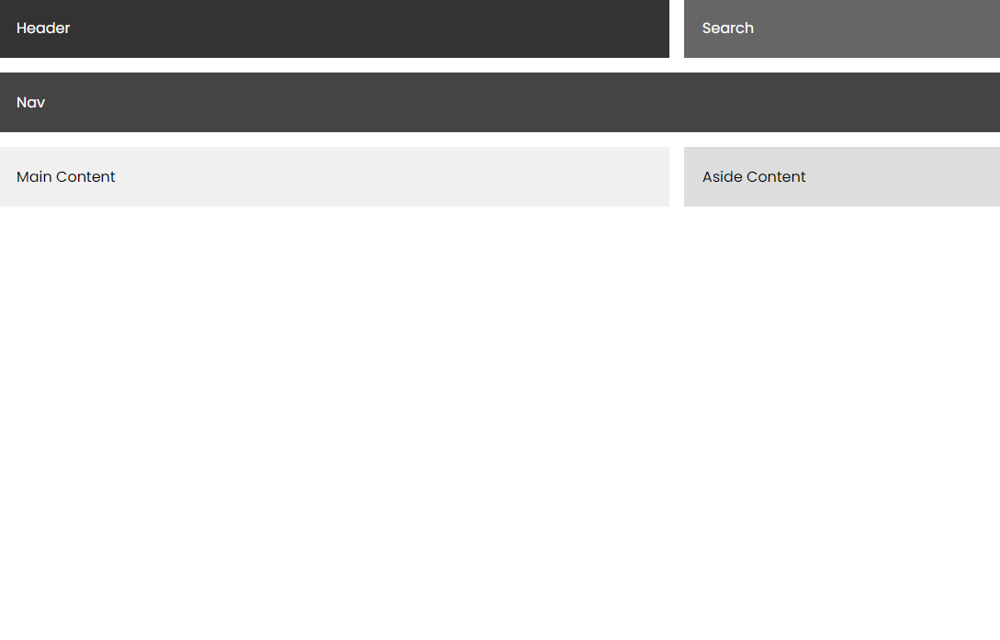

## Grid Template Areas

In this lesson, we are going to look at a really cool feature of CSS Grid called grid-template-areas. This feature allows you to define areas of your layout and place items in those areas.

Let's use the following HTML to start. We have a header, search and nav. The rest is commented out for now:

```html
<div class="container">
  <header>Header</header>
  <div class="search">Search</div>
  <nav>Nav</nav>
  <!-- <main>Main Content</main> -->
  <!-- <aside>Aside Content</aside> -->
  <!-- <footer>Footer</footer> -->
</div>
```

And the following CSS:

```css
* {
  margin: 0;
  padding: 0;
  box-sizing: border-box;
}

body {
  font-family: Arial, sans-serif;
}

.container {
  display: grid;
  gap: 1rem;
}

header {
  background-color: #333;
  color: #fff;
  padding: 20px;
}

nav {
  background-color: #444;
  color: #fff;
  padding: 20px;
}

.search {
  background-color: #666;
  color: #fff;
  padding: 20px;
}

main {
  background-color: #f0f0f0;
  padding: 20px;
}

aside {
  background-color: #ddd;
  padding: 20px;
}

footer {
  background-color: #666;
  color: #fff;
  padding: 20px;
}
```

We want it to look like this:



With grid-template-areas, Let's create a one column layout with the header at the top, the search in the middle and the nav at the bottom. We can do this by adding the following CSS to the container element:

```css
.container {
  display: grid;
  grid-template-areas:
    'header'
    'search'
    'nav';
  gap: 1rem;
}
```

This is a visual representation of the layout.

### Naming Areas

Right now, it doesn't know what the header, search and nav are. We need to name the areas. We can do this by using the 'grid-area' property:

```css
header {
  background-color: #333;
  color: #fff;
  padding: 20px;
  grid-area: header; /* This is the name of the area */
}

nav {
  background-color: #444;
  color: #fff;
  padding: 20px;
  grid-area: nav; /* This is the name of the area */
}

.search {
  background-color: #666;
  color: #fff;
  padding: 20px;
  grid-area: search; /* This is the name of the area */
}
```

Now you should see all 3 on top of each other.

Let's move the search into the same row as the header in a new column:

```css
.container {
  display: grid;
  grid-template-areas:
    'header search'
    'nav nav';
  gap: 1rem;
}
```

Since we now have a 2 column layout, we had to also add another column to the nav.

It should look like this now:



You can also use the devtools to see the actual columns. Click on the `Layout` tab and check the grid container checkbox.



I actually want the search to be smaller than the header width-wise. So we can add another column to the layout and span the header 2 columns:

```css
.container {
  display: grid;
  grid-template-areas:
    'header header search'
    'nav nav nav';
  gap: 1rem;
}
```

Now it should look like this:



Let's add the main content and aside to the layout. Uncomment the main and aside elements in the HTML and add the following CSS to the container element:

```css
.container {
  display: grid;
  grid-template-areas:
    'header header search'
    'nav nav nav'
    'main main aside';
  gap: 1rem;
}
```

Then we need to add the grid-area property to the main and aside elements:

```css
main {
  background-color: #f0f0f0;
  padding: 20px;
  grid-area: main;
}

aside {
  background-color: #ddd;
  padding: 20px;
  grid-area: aside;
}
```

I actually want the search and aside to both be smaller width-wise. Let's make it a 4 column layout:

```css
.container {
  display: grid;
  grid-template-areas:
    'header header header search'
    'nav nav nav nav'
    'main main main aside';
  gap: 1rem;
}
```



Finally, we will add the footer. Uncomment the footer element in the HTML and add the following CSS to the container element:

```css
.container {
  display: grid;
  grid-template-areas:
    'header header header search'
    'nav nav nav nav'
    'main main main aside'
    'footer footer footer footer';
  gap: 1rem;
}
```

Then we need to add the grid-area property to the footer element:

```css
footer {
  background-color: #666;
  color: #fff;
  padding: 20px;
  grid-area: footer;
}
```

Now we have our layout:


## Make it Responsive

We can make this layout responsive by using media queries. We can stack everything in a one column layout on smaller screens. Add the following CSS:

```css
@media (max-width: 768px) {
  .container {
    grid-template-areas:
      'header'
      'search'
      'nav'
      'main'
      'aside'
      'footer';
  }
}
```
