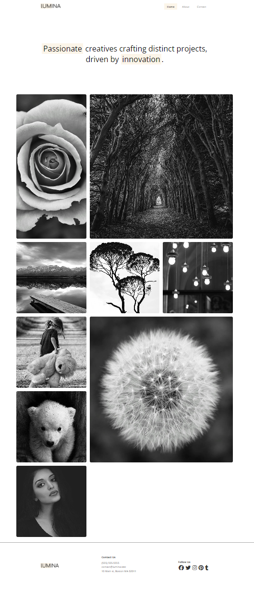
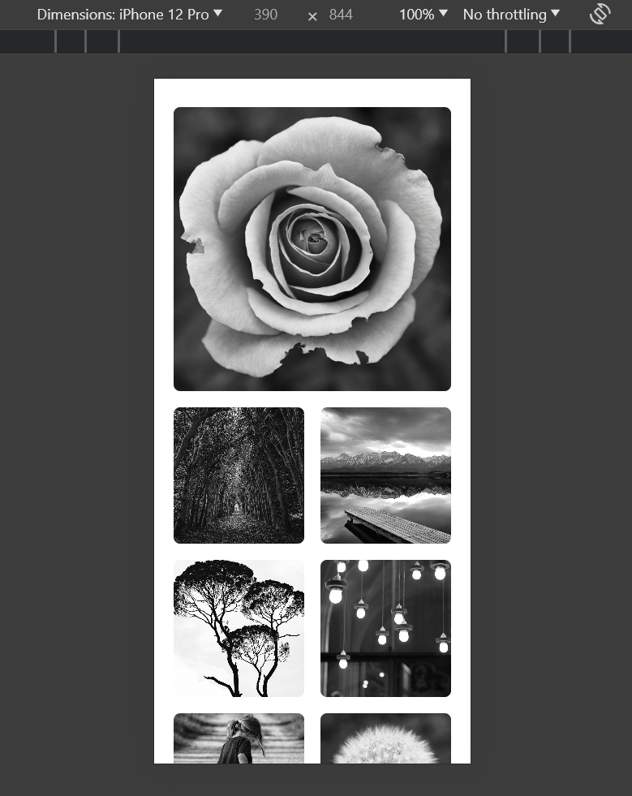

# Lumina Creative Grid Refactor

In this project, you'll refactor the Lumina Creative website gallery section using CSS Grid. We are going to have some of the images span rows and columns and ultimately look like this:



Let's get right into it. I suggest copying the existing project that you have or just downloading the original version from this lesson or the main repo and rename the folder to `lumina-creative-grid`. Open it up in your editor.

## Step 1: Set up the grid

There is only one change that we need to make in the HTML and that is renaming the `gallery-flex` class to `gallery-grid`.

We can then go right to the CSS and go to the gallery section that currently looks like this:

```css
/* Gallery */
.gallery-flex {
  display: flex;
  flex-wrap: wrap;
  gap: 20px;
}

.gallery-item {
  flex: 0 0 calc(33.333% - 20px); /* Set item width to 33.333% minus gap */
  overflow: hidden;
  border-radius: 8px;
}

.gallery-item:hover {
  opacity: 0.9;
}
```

Change the `gallery-flex` class to `gallery-grid` and add the following styles:

```css
.gallery-grid {
  display: grid;
  grid-template-columns: repeat(3, 1fr);
  grid-auto-rows: auto;
  gap: 20px;
}
```

We are setting up a 3 column grid with a gap of 20px. The `grid-auto-rows` property is set to `auto` so that the rows will automatically adjust to the content.

The gallery will now look pretty much the same as it did with flexbox. So if you want to simply create rows and columns, you can stop here. But we want to make some of the images span rows and columns.

You can also remove the `flex: 0 0 calc(33.333% - 20px);` from the `.gallery-item` class since we are not using flexbox anymore.

```css
.gallery-item {
  overflow: hidden;
  border-radius: 8px;
}
```

## Step 2: Fit the images

We are going to make the images fit the grid cells. We can do this by setting the `object-fit` property to `cover` on the images.

Add the following CSS:

```css
.gallery-item img {
  width: 100%;
  height: 100%;
  object-fit: cover;
}
```

This will make the images fit the grid cells and maintain their aspect ratio.

## Step 3: Spanning rows and columns

We are going to make some of the images span rows and columns. We can do this by using the `grid-column` and `grid-row` properties.

I want the second image to span 2 columns from where it currently is. We can use the `nth-of-type` selector to target the second image.

Add the following CSS:

```css
/* Spans */
.gallery-item:nth-of-type(2) {
  grid-column: span 2;
}
```

Now the second image will span 2 columns.

Let's also make the seventh image span 2 rows and 2 columns. We can use the `nth-of-type` selector to target the seventh image.

Add the following CSS:

```css
.gallery-item:nth-of-type(7) {
  grid-column: span 2;
  grid-row: span 2;
}
```

I think that looks good. If you want to play around with the grid some more, feel free to do so.

## Making It Responsive

Let's make it so that on smaller screens there are 2 columns with one large image at the top that spans 2 columns.

Go down to the media query and remove the `gallery-item` styling and add the following:

```css
.gallery-grid {
  grid-template-columns: repeat(2, 1fr);
}

.gallery-item:nth-of-type(1) {
  grid-column: span 2;
}

.gallery-item:nth-of-type(2) {
  grid-column: span 1;
}

.gallery-item:nth-of-type(7) {
  grid-column: span 1;
  grid-row: span 1;
}
```

First, we set the grid to have 2 columns. Then we make the first image span 2 columns. We want to reset the second image to span 1 column. And finally, we want to reset the seventh image to span 1 column and 1 row.

It should look like this on small screens:


