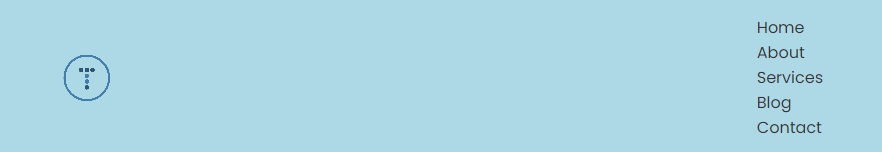
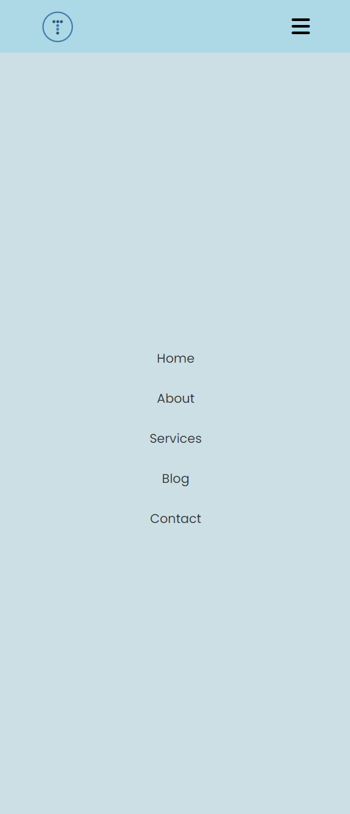

# Hamburger Menu

Most websites have a horizontal navigation bar at the top of the page. But what if there are too many menu items to fit on the screen? If there are not too many links, we can do what we did in the Lumina Creative project and make the navigation bar responsive by moving it onto it's own line or stacking the items vertically. But if there are a lot of links or you want to use a more elegant solution, you can use a hamburger menu. These are the menus with an icon that looks like a hamburger with 3 lines. When you click on it, the menu expands and shows the links. You need to add a little bit of JavaScript to make it work, but it's not too difficult.

Let's start by creating the initial navbar without the mobile menu. Here is the initial HTML:

```html
<!DOCTYPE html>
<html lang="en">
  <head>
    <meta charset="UTF-8" />
    <meta name="viewport" content="width=device-width, initial-scale=1.0" />
    <link rel="preconnect" href="https://fonts.googleapis.com" />
    <link rel="preconnect" href="https://fonts.gstatic.com" crossorigin />
    <link
      href="https://fonts.googleapis.com/css2?family=Poppins:wght@300;400;500;600;700;800&display=swap"
      rel="stylesheet"
    />
    <link
      rel="stylesheet"
      href="https://cdnjs.cloudflare.com/ajax/libs/font-awesome/6.5.1/css/all.min.css"
      integrity="sha512-DTOQO9RWCH3ppGqcWaEA1BIZOC6xxalwEsw9c2QQeAIftl+Vegovlnee1c9QX4TctnWMn13TZye+giMm8e2LwA=="
      crossorigin="anonymous"
      referrerpolicy="no-referrer"
    />
    <link rel="stylesheet" href="styles.css" />
    <title>HTML & CSS Sandbox</title>
  </head>
  <body>
    <nav class="navbar">
      <div class="navbar-container container">
        
        <div class="main-menu">
          <ul class="main-menu-list">
            <li>
              <a href="#">Home</a>
            </li>
            <li>
              <a href="#about">About</a>
            </li>
            <li>
              <a href="#services">Services</a>
            </li>
            <li>
              <a href="#blog">Blog</a>
            </li>
            <li>
              <a href="#contact">Contact</a>
            </li>
          </ul>
        </div>
        <!-- Mobile Menu -->
      </div>
    </nav>
  </body>
</html>
```

For now, I just put a comment where the hamburger icon and mobile menu will go. We also included a link to Font Awesome because I will be using their hamburger icon.

Here is the initial base CSS:

```css
* {
  margin: 0;
  padding: 0;
  box-sizing: border-box;
}

body {
  font-family: 'Poppins', sans-serif;
}

a {
  text-decoration: none;
  color: #333;
}

li {
  list-style: none;
}

img {
  width: 100%;
}
```

Let' first add the container styles. You don't NEED a container but it's a good idea to keep the content centered and not too wide on larger screens. Here is the CSS:

```css
.container {
  max-width: 1100px;
  margin: 0 auto;
  padding: 0 2rem;
}
```

For the navbar itself, we are just going to add a height, background color and some padding:

```css
.navbar {
  padding: 1rem 2rem;
  background: lightblue;
  height: 80px;
}
```

Let's make the logo much smaller:

```css
.navbar .logo {
  width: 50px;
}
```

I added a navbar container class because we want to use flexbox to control the layout and spacing. We want the logo on the left and the menu items on the right. Here is the CSS:

```css
.navbar .navbar-container {
  display: flex;
  justify-content: space-between;
  align-items: center;
}
```

It should look like this so far:



We also want to use flexbox to style the menu items. We want them to be in a row and spaced out. Here is the CSS:

```css
.navbar .main-menu-list {
  display: flex;
  align-items: center;
  gap: 1.5rem;
}
```


Now let's add some hover effects to the links:

```css
.navbar .main-menu-list a:hover {
  color: blue;
}
```

## Hide Main Menu on Mobile

We want to hide the main menu on mobile and fonly show the hamburger icon. We can do this by using media queries. Here is the CSS:

```css
@media (max-width: 768px) {
  .main-menu {
    display: none;
  }
}
```

Now you should not see the main menu on mobile/small screens.

## Hamburger Icon & Mobile Menu HTML

Now, let's add the hamburger icon and the mobile menu. This will go just under the ending`</div>` after the ending `</ul>` where the comment is.

Here is the updated HTML:

```html
<!-- Mobile Menu -->
<div class="mobile-menu">
  <!-- Hamburger button -->
  <div class="mobile-menu-toggle">
    <i class="fas fa-bars fa-2x"></i>
  </div>
  <!-- Mobile menu -->
  <div class="mobile-menu">
    <ul class="mobile-menu-list">
      <li>
        <a href="#">Home</a>
      </li>
      <li>
        <a href="#about">About</a>
      </li>
      <li>
        <a href="#services">Services</a>
      </li>
      <li>
        <a href="#blog">Blog</a>
      </li>
      <li>
        <a href="#contact">Contact</a>
      </li>
    </ul>
  </div>
</div>
```

We need to add some styles to the mobile menu. I want to place the menu items under the navbar. Obviously, this will only show when the hamburger icon is clicked, but for now it will show all the time.

Here is the CSS:

```css
/* Mobile Menu */
.navbar .mobile-menu {
  position: absolute;
  top: 80px;
  bottom: 0;
  left: 0;
  width: 100%;
  background: rgba(154, 192, 204, 0.5);
  text-align: center;
  transition: transform 0.3s ease;
}
```

We are positioning it to start at the bottom of the 80px navbar and go all the way to the bottom. We added a transparent background color and centered the text. We also added a transition so it will slide down when we click the hamburger icon. We will use the `transform` property to do this with `translateY`.

Now we need to style the list items and links. Here is the CSS:

```css
.navbar .mobile-menu-list {
  display: flex;
  flex-direction: column;
  align-items: center;
  padding-top: 300px;
  height: 100%;
  gap: 2rem;
  font-size: 1.2rem;
}
```

We are using flexbox to space them out and some padding to push them down. We also increased the font size.

Let's add the mobile links to the hover for the regular links:

```css
.navbar .main-menu a:hover,
.navbar .mobile-menu a:hover {
  color: blue;
}
```

It should look like this:



The hamburger menu is pretty much complete. Sometimes people will create the actual icon using CSS, but I prefer to use Font Awesome. You can also use other icon libraries or create your own. I do want to make the cursor a pointer when hovering over the hamburger icon. Here is the CSS:

```css
.navbar .mobile-menu-toggle {
  cursor: pointer;
}
```

## Hiding The Mobile Menu

We want to hide the mobile menu unless the hamburger icon is clicked. Since we want it to slide out from the right, what we can do is use the `transform` property to move it off the screen. Here is the CSS:

```css
.navbar .mobile-menu {
  //...
  transform: translatex(100%); /*Hide the mobile menu items off screen*/
}
```

It is pushing it off the screen to the right. Now we need a class that will move it back onto the screen.

Add the following CSS:

```css
.navbar .mobile-menu.active {
  transform: translatex(0); /* Show the mobile menu items */
}
```

If you manually add the `active` class to the mobile menu items div, it will slide in from the right. We will use JavaScript to toggle this class.

## JavaScript

We need to add some JavaScript to toggle the `active` class on the mobile menu items. Here is the JavaScript:

```js
document.addEventListener('DOMContentLoaded', function () {
  // Get hamburger button and mobile menu items
  const toggleButton = document.querySelector('.navbar .mobile-menu-toggle');
  const mobileMenu = document.querySelector('.navbar .mobile-menu');

  // Add click event listener to toggle mobile menu visibility
  toggleButton.addEventListener('click', function () {
    mobileMenu.classList.toggle('active');
  });
});
```

We are listening for the `DOMContentLoaded` event so that the JavaScript will run after the HTML has loaded. We are getting the hamburger button and mobile menu items and adding a click event listener to the hamburger button. When it is clicked, it will toggle the `active` class on the mobile menu items.

Now when you click the hamburger icon, the mobile menu should slide in from the right. Click it again and it will slide back out.

## Hide the Hamburger Icon on Desktop

We only want to show the hamburger icon on mobile. We can do this by using media queries. Here is the CSS:

```css
/* Put this outside of media query */
.navbar .mobile-menu {
  display: none;
}

@media (max-width: 768px) {
  //...

  /* Add this to media query */
  .navbar .mobile-menu {
    display: block;
  }
}
```

That's it! you can change things around, but feel free to use this as a starting point for your own hamburger menu.
