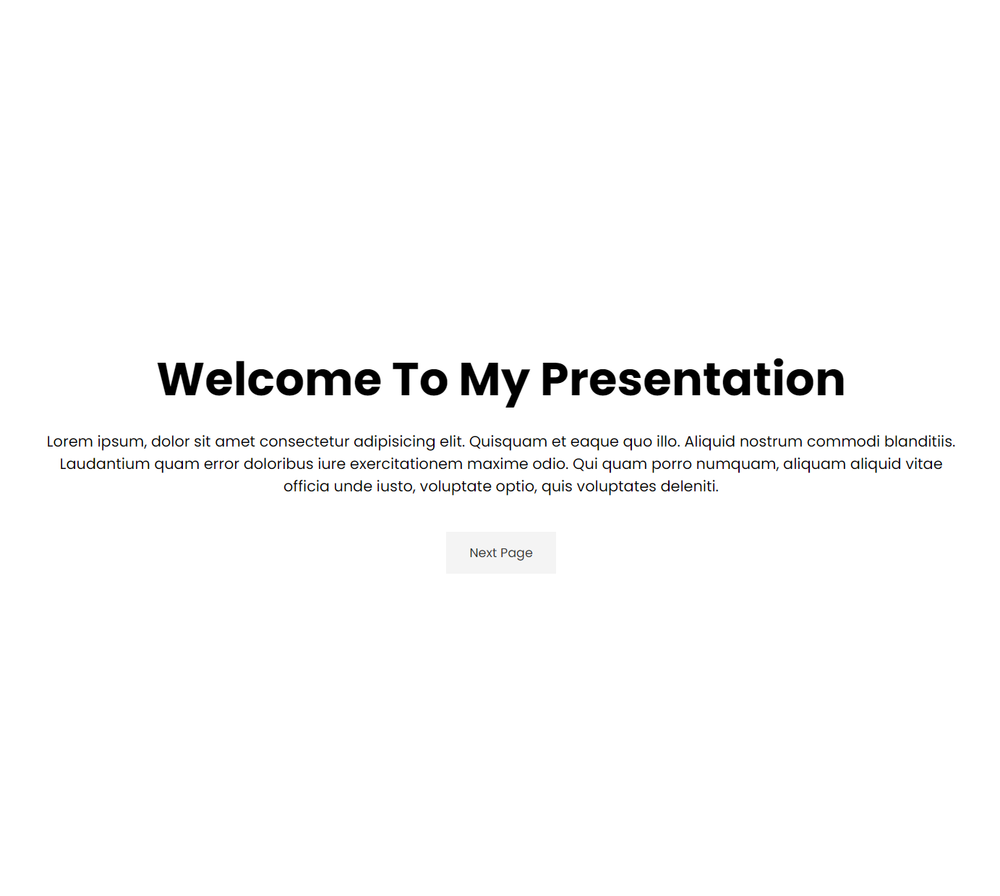

# Presentation Website Mini-Project

In this lesson, we're going to take what we've learned about transitions, keyframes and animations and create a presentation website. This probably isn't something that you would deploy and have users go to, but you could use it in a presentation as kind of a Powerpoint or Keynote replacement.

We will have 4 pages and of course you can add more. There will be a button on each page to go to the next page. If there is a previous page, there will be a button to go back. We will also add a little keyframe animation for the text to slide in.

Let's get started.

Here is the HTML:

```html
<!-- Page 1 (Intro) -->
<section id="page-1" class="page page-1">
  <h1>Welcome To My Presentation</h1>
  <p>
    Lorem ipsum, dolor sit amet consectetur adipisicing elit. Quisquam et eaque
    quo illo. Aliquid nostrum commodi blanditiis. Laudantium quam error
    doloribus iure exercitationem maxime odio. Qui quam porro numquam, aliquam
    aliquid vitae officia unde iusto, voluptate optio, quis voluptates deleniti.
  </p>
  <div>
    <a href="#page-2" class="btn">
      Next Page <i class="fas fa-arrow-circle-down"></i>
    </a>
  </div>
</section>

<!-- Page 2 -->
<section id="page-2" class="page page-2">
  <h1>Page 2</h1>
  <p>
    Lorem ipsum, dolor sit amet consectetur adipisicing elit. Quisquam et eaque
    quo illo. Aliquid nostrum commodi blanditiis. Laudantium quam error
    doloribus iure exercitationem maxime odio. Qui quam porro numquam, aliquam
    aliquid vitae officia unde iusto, voluptate optio, quis voluptates deleniti.
  </p>
  <div>
    <a href="#page-1" class="btn btn-dark">
      Prev Page <i class="fas fa-arrow-circle-up"></i>
    </a>
    <a href="#page-3" class="btn">
      Next Page <i class="fas fa-arrow-circle-down"></i>
    </a>
  </div>
</section>

<!-- Page 3 -->
<section id="page-3" class="page page-3">
  <h1>Page 3</h1>
  <p>
    Lorem ipsum, dolor sit amet consectetur adipisicing elit. Quisquam et eaque
    quo illo. Aliquid nostrum commodi blanditiis. Laudantium quam error
    doloribus iure exercitationem maxime odio. Qui quam porro numquam, aliquam
    aliquid vitae officia unde iusto, voluptate optio, quis voluptates deleniti.
  </p>
  <div>
    <a href="#page-2" class="btn btn-dark">
      Prev Page <i class="fas fa-arrow-circle-up"></i>
    </a>
    <a href="#page-4" class="btn">
      Next Page <i class="fas fa-arrow-circle-down"></i>
    </a>
  </div>
</section>

<!-- Page 4 -->
<section id="page-4" class="page page-4">
  <h1>Page 4</h1>
  <p>
    Lorem ipsum, dolor sit amet consectetur adipisicing elit. Quisquam et eaque
    quo illo. Aliquid nostrum commodi blanditiis. Laudantium quam error
    doloribus iure exercitationem maxime odio. Qui quam porro numquam, aliquam
    aliquid vitae officia unde iusto, voluptate optio, quis voluptates deleniti.
  </p>
  <div>
    <a href="#page-3" class="btn">
      Prev Page <i class="fas fa-arrow-circle-up"></i>
    </a>
  </div>
</section>
```

So we have 4 sections with the class of `page` and an `id` of `page-1`, `page-2`, etc. Each section has an `h1` and a `p` tag with some text. The first section has a button to go to the next page and the last section has a button to go to the previous page.

## Base CSS

Here is the base CSS:

```css
* {
  margin: 0;
  padding: 0;
  box-sizing: border-box;
}

html,
body {
  font-family: 'Poppins', sans-serif;
  scroll-behavior: smooth;
}
```

We just set the margin and padding to 0 and the box-sizing to border-box. We also set the font-family to 'Poppins'.

It's also important to set `scroll-behavior: smooth;` so that when you click on a link to go to a different section, it will scroll smoothly.

## `page` Class

I want each page to take up the entire viewport height and I want it centered. We will use flexbox to center. Here is the CSS for the `page` class:

```css
.page {
  display: flex;
  flex-direction: column;
  height: 100vh;
  align-items: center;
  justify-content: center;
  text-align: center;
  padding: 0 4rem;
}
```

Now each page will take up the entire viewport height and be centered. The text will also be centered.

The buttons will work. They will take you to the next or previous page because the `href` is set to the `id` of the next or previous page.

## Page Content

Let's style the text and buttons:

```css
/* Page Content */
.page h1 {
  font-size: 4rem;
  line-height: 1.2;
  margin: 2rem;
}

.page p {
  font-size: 1.3rem;
}

.btn {
  display: inline-block;
  padding: 1rem 2rem;
  background: #f4f4f4;
  color: #333;
  text-decoration: none;
  border: none;
  margin-top: 3rem;
  font-size: 1.1rem;
  transition: all 0.3s ease-in;
}

.btn:hover,
.btn-dark {
  background: #333;
  color: #fff;
}

.btn-dark:hover {
  background: #f4f4f4;
  color: #333;
}
```

We added some basic styles for font sizes, spacing, etc. We have a hover effect for the buttons and added a transition to make it smooth.

It should look like this so far:



## Page Colors

I want each page to have a different color. Let's use CSS custom properties to that we have a single place to change them if needed. We will also have a custom property for the animation speed. Add this to the `:root` selector at the top of the CSS file:

```css
:root {
  --page-1-color: steelblue;
  --page-2-color: tan;
  --page-3-color: teal;
  --page-4-color: slateblue;
  --animate-speed: 2s;
}
```

Now add the colors to the `page` classes:

```css
/* Page Colors */
.page-1 {
  background: var(--page-1-color);
}
.page-2 {
  background: var(--page-2-color);
}
.page-3 {
  background: var(--page-3-color);
}
.page-4 {
  background: var(--page-4-color);
}
```

Now each page will have a different color. You can change the colors by changing the CSS custom properties.

I am also going to change the default page text color to white:

```css
.page {
  // ...
  color: #fff;
}
```

That is pretty much it as far as the presentation. You can easily add pages if you want.

## Animating the Text

I want the first page to have the text slide in. We can do that with the following keyframes:

```css
/* Keyframes */
@keyframes headingSlide {
  to {
    transform: translateY(0);
  }
}

@keyframes textSlide {
  to {
    transform: translateX(0);
  }
}
```

The heading will come in from the top and the text will come in from the left.

We want to initially place the text off the screen. We can do that with the following CSS:

```css
/* Page Animation */
#page-1 h1 {
  transform: translateY(-1200px);
}

#page-1 p {
  transform: translateX(-1800px);
}
```

Now, apply the keyframes to the text:

```css
/* Page Animation */
#page-1 h1 {
  transform: translateY(-1200px);
  animation: heading var(--animate-speed) forwards ease-in;
}

#page-1 p {
  transform: translateX(-1800px);
  animation: text var(--animate-speed) forwards ease-in 1s;
}
```

We are using the variable `--animate-speed` for the animation duration. The text will slide in after the heading.

That's it! You now have a simple presentation website that you can use for a presentation. Of course, you can make it prettier and add images, charts, etc.
