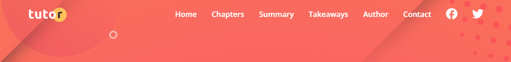
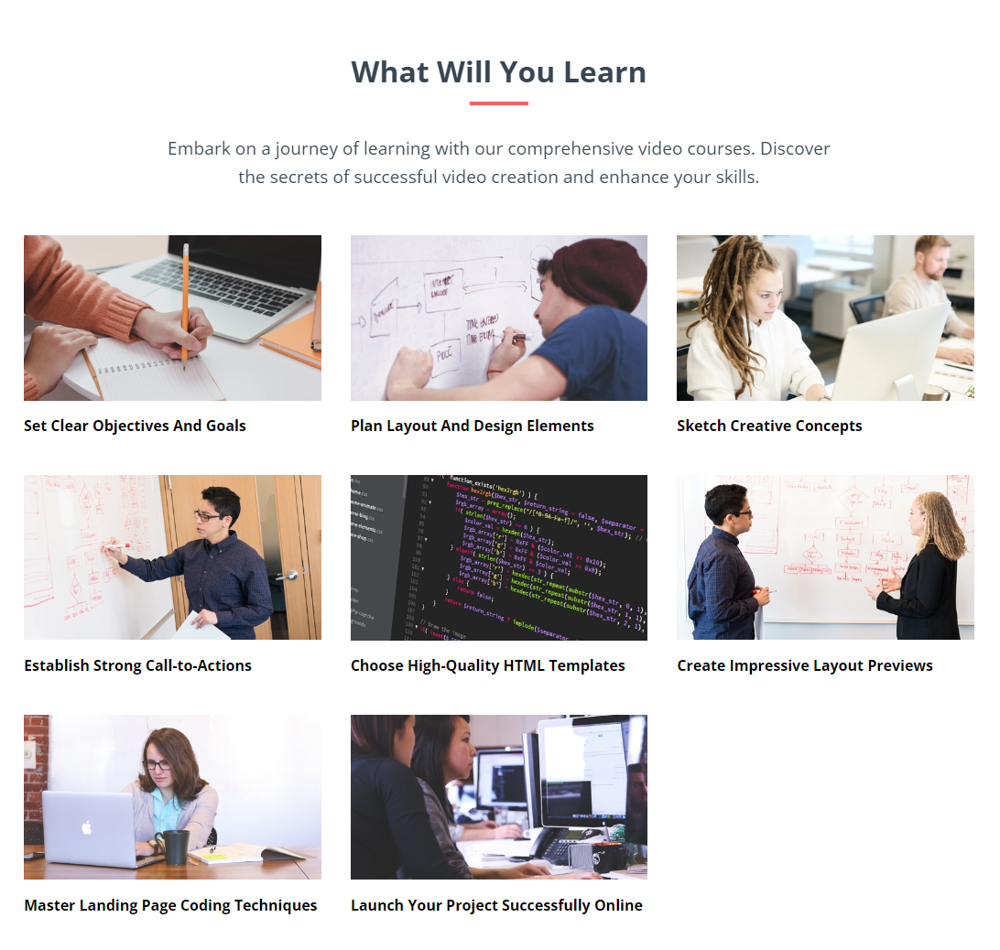
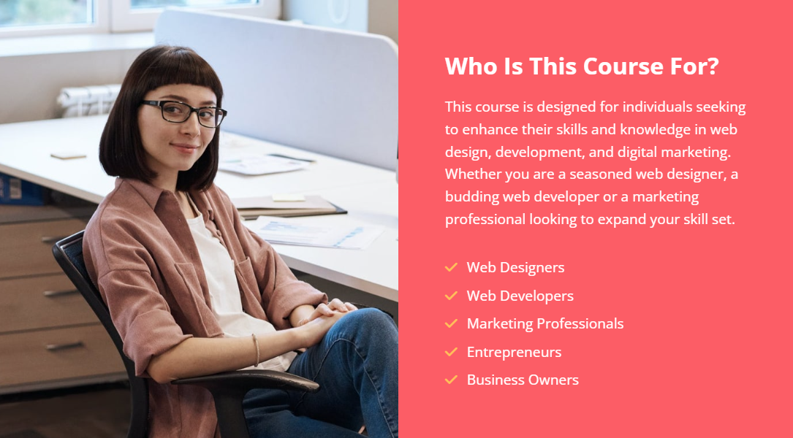
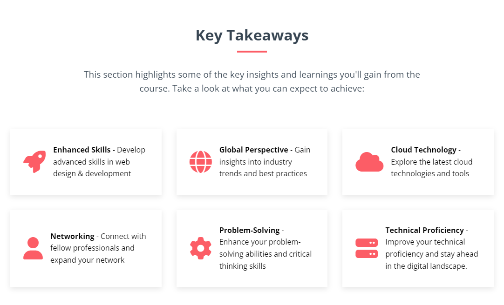
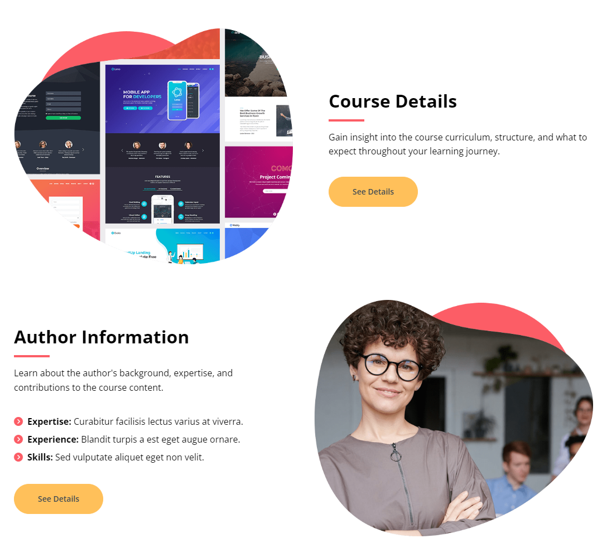
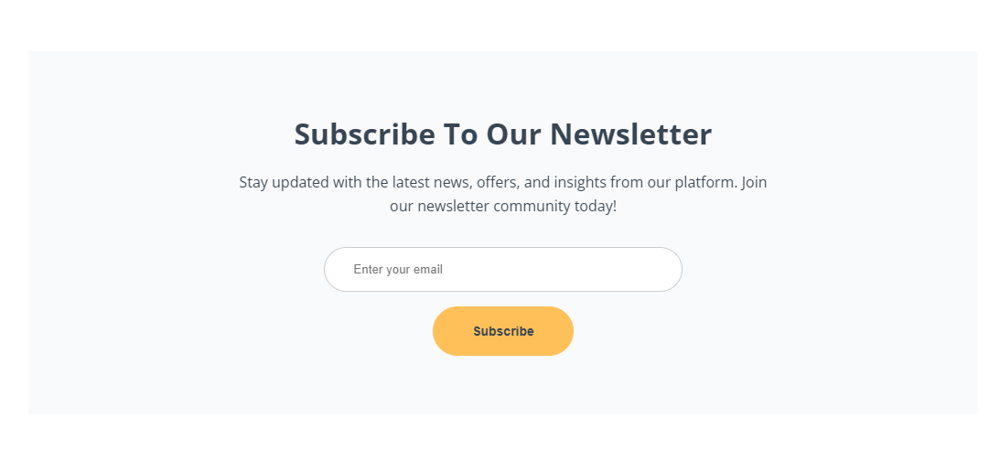
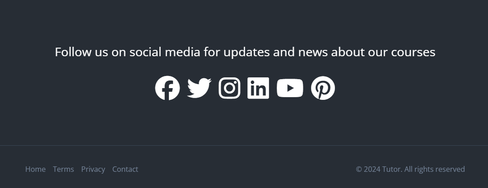
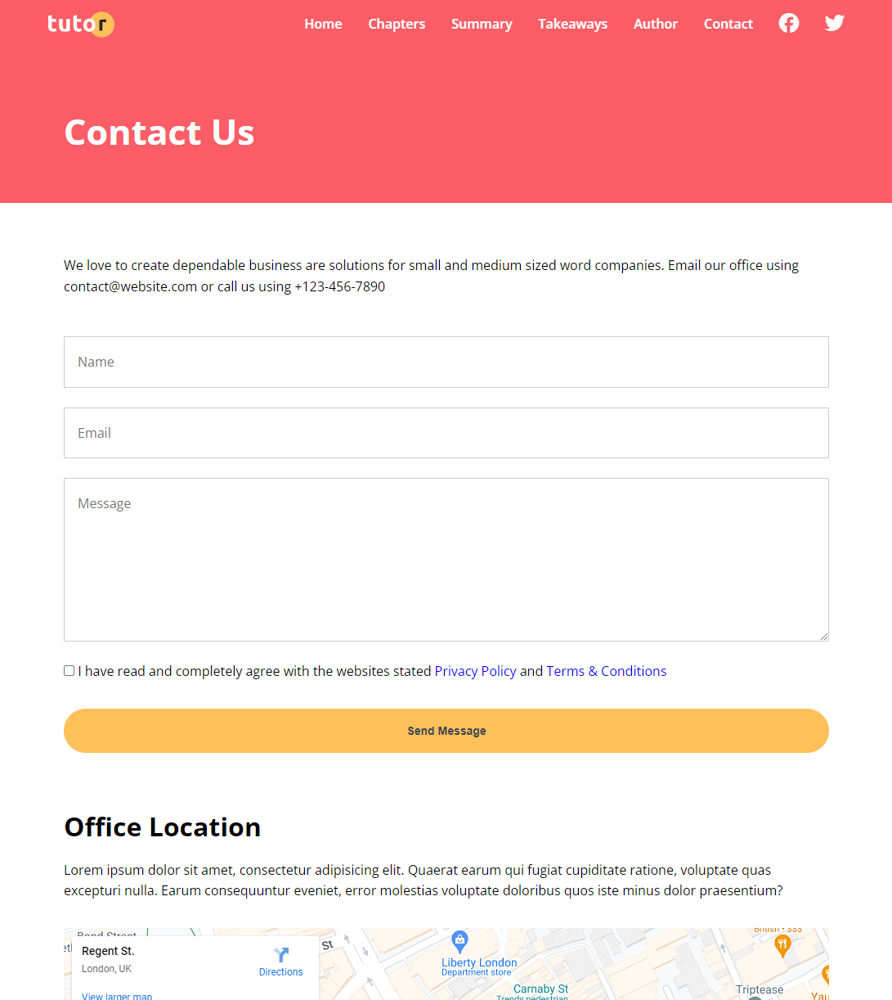

# Tutor Website

The next project that we are going to build is called "Tutor". It is a responsive website for a course on creating your own tutoring courses.

We will have a large landing page with different sections as well as a contact page with a form and map.

The main landing page will have the following sections:

### 1. Navbar

The navbar will stick to the top and have a logo on the left and links on the right. The links will be Home, Chapters, Summary, Takeaways, Author, Contact and two social media icons/links.

We are going to implement a bit of JavaScript here to make the menu responsive. We will make it so that when the screen is below a certain width, the menu will turn into a hamburger menu. Then we click on the menu and the links will slide over from the right.

We will also add a bit of JS so that when we scroll, the navbar will change from transparent to a semi-solid color. That way it will be easier to read the links.

### 2. Hero

The hero will have a background image with a gradient overlay. On the left, will bee a title, subtitle and a button. On the right will be an image. We will also use an SVG at the bottom to give it a wave effect.

### 3. Learn Section

This section will have a title, subtitle and a grid of images with text. The grid will be responsive and use CSS Grid. We will also apply a hover effect to the images.

### 4. Chapters Section

This section will have a title, subtitle and a grid of cards with icons and text. We will use CSS Grid to layout the cards and make them responsive.

### 5. Summary Section

This section will have a title and a list of chapters and sections.

### 6. Info Section

This will be a simple section with a title, subtitle and a paragraph of text on the right and a background image on the left.

### 7. Takeaways Section

This section will have a title, subtitle and a grid of cards with icons and text. We will use CSS Grid to layout the cards and make them responsive.

### 8. Details & Author Section

These sections will have an image on one side and text and a button on the other. We will use flexbox to layout the sections and make them responsive.

### 9. Stats Section

This section will have some numbers as headings such as users, issues, solved, etc along with an image, button and a background gradient and image. it will use flexbox.

### 10. Newsletter Section

This section will have a title, subtitle and a styled form.

### 11. Social & Footer

We will have an area with some text and social icons and then the footer below it with some links and text.

## Contact Page

The contact page will have a header area with text and a form with a map. The form will have a name, email and message input as well as a checkbox to agree with the terms.

We will embed a Google Map under the form as well.

