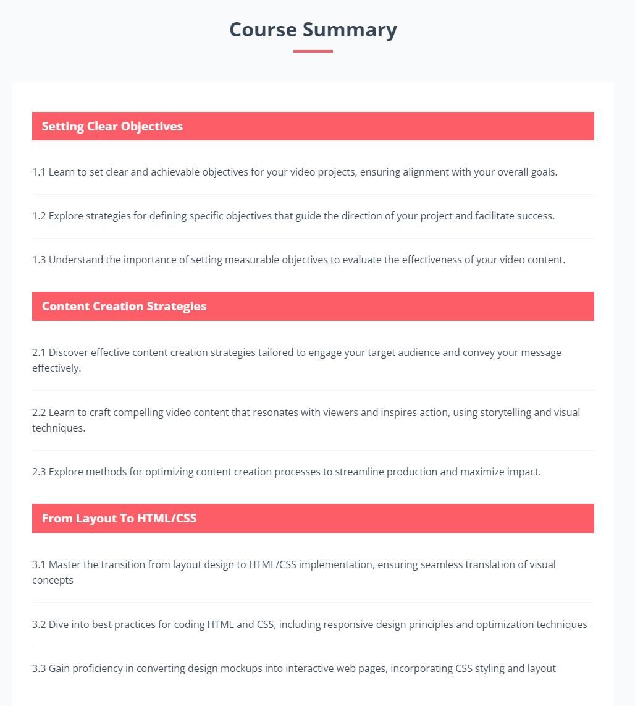

# Summary Section

The summary section is a list of chapters with a list of modules for each chapter. This section is a great way to give an overview of the course content. It can help students understand what they will learn and how the course is structured.

## HTML

Let's add the HTML directly under the chapters section:

```html
<!-- Course Summary -->
<section class="summary" id="summary">
  <div class="container">
    <div class="section-header">
      <h2>Course Summary</h2>
      <div class="heading-border"></div>
    </div>
    <div class="section-lists">
      <div class="list">
        <div class="list-header">Setting Clear Objectives</div>
        <div class="list-item">
          1.1 Learn to set clear and achievable objectives for your video
          projects, ensuring alignment with your overall goals.
        </div>
        <div class="list-item">
          1.2 Explore strategies for defining specific objectives that guide the
          direction of your project and facilitate success.
        </div>
        <div class="list-item">
          1.3 Understand the importance of setting measurable objectives to
          evaluate the effectiveness of your video content.
        </div>
      </div>

      <div class="list">
        <div class="list-header">Content Creation Strategies</div>
        <div class="list-item">
          2.1 Discover effective content creation strategies tailored to engage
          your target audience and convey your message effectively.
        </div>
        <div class="list-item">
          2.2 Learn to craft compelling video content that resonates with
          viewers and inspires action, using storytelling and visual techniques.
        </div>
        <div class="list-item">
          2.3 Explore methods for optimizing content creation processes to
          streamline production and maximize impact.
        </div>
      </div>

      <div class="list">
        <div class="list-header">From Layout To HTML/CSS</div>
        <div class="list-item">
          3.1 Master the transition from layout design to HTML/CSS
          implementation, ensuring seamless translation of visual concepts
        </div>
        <div class="list-item">
          3.2 Dive into best practices for coding HTML and CSS, including
          responsive design principles and optimization techniques
        </div>
        <div class="list-item">
          3.3 Gain proficiency in converting design mockups into interactive web
          pages, incorporating CSS styling and layout
        </div>
      </div>
    </div>
  </div>
</section>
```

We are using the usual format with the section container and header. Then we have a `section-lists` container that holds all the chapter lists. Each chapter is a `list` with a `list-header` and multiple `list-item` elements.

## CSS

Let's add the following CSS to the `style.css` file:

```css
/* Summary */
.summary {
  background: var(--light-color);
  color: #384653;
  padding: 4rem 2rem 5rem;
}

.summary .section-lists {
  background: #fff;
  padding: 2rem;
}

.summary .list-header {
  background: var(--primary-color);
  color: #fff;
  padding: 0.5rem 1rem;
  font-size: 1.2rem;
  font-weight: 700;
  margin: 1rem 0;
}

.summary .list-item {
  padding: 1.4rem 0;
  border-bottom: 1px solid #f1f4f6;
}

.summary .list-item:last-child {
  border-bottom: none;
}
```

We are setting the background color of the summary section to a light color and the text color to a dark shade. The chapter lists have a white background with padding. The chapter headers have a primary color background with white text. The list items have padding and a bottom border to separate them.

We use the pseudo-class `:last-child` to remove the border from the last list item.

It is already pretty responsive, however, I do want to remove some of the padding on mobile screens, so let's add the following CSS to the `576px` media query:

```css
/* Screens less than 576 */
@media screen and (max-width: 576px) {
  /* ...Other styles */

  .summary .section-lists {
    padding: 1rem;
  }
}
```

The section should look like this:


