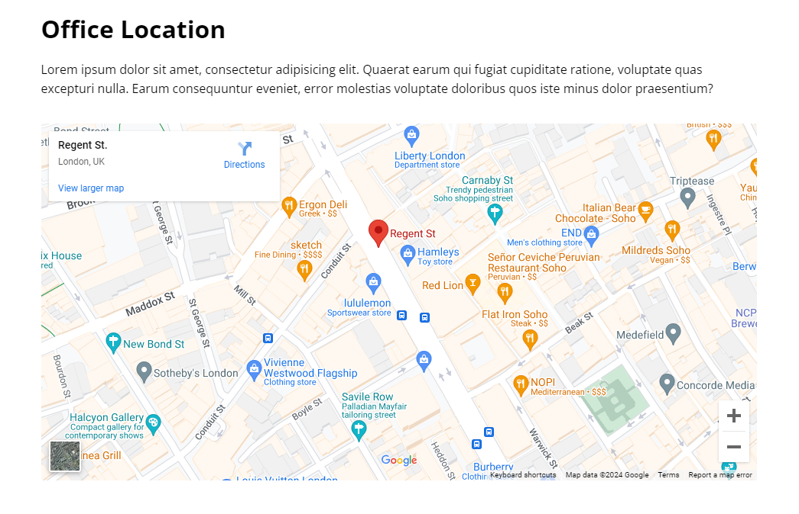

# Contact Page

Now we will create the contact page, which will have a simple header with some text, a contact form, and a map. Obviously, it will also have the navbar and footer.

## HTML

Start by copying everything from the `index.html` and then add it to a new page called `contact.html`. Then, remove everything between the navbar and social section.

### Change links

Change the links in the navbar to point to the 'index.html' page. Replace the home `#` with `index.html` and make the rest of the links point to the correct sections on the page. For instance, this is what the summary page link should look like:

```html
<a href="index.html#summary">Summary</a>
```

This will leave you with the following code:

```html
<!DOCTYPE html>
<html lang="en">
  <head>
    <meta charset="UTF-8" />
    <meta name="viewport" content="width=device-width, initial-scale=1.0" />
    <link rel="preconnect" href="https://fonts.googleapis.com" />
    <link rel="preconnect" href="https://fonts.gstatic.com" crossorigin />
    <link
      href="https://fonts.googleapis.com/css2?family=Open+Sans:ital,wght@0,300..800;1,300..800&display=swap"
      rel="stylesheet"
    />
    <link
      rel="stylesheet"
      href="https://cdnjs.cloudflare.com/ajax/libs/font-awesome/6.5.1/css/all.min.css"
      integrity="sha512-DTOQO9RWCH3ppGqcWaEA1BIZOC6xxalwEsw9c2QQeAIftl+Vegovlnee1c9QX4TctnWMn13TZye+giMm8e2LwA=="
      crossorigin="anonymous"
      referrerpolicy="no-referrer"
    />
    <link rel="stylesheet" href="css/styles.css" />
    <link rel="icon" href="images/favicon.png" />
    <title>Welcome To Tutor</title>
  </head>
  <body>
    <!-- Navbar -->
    <nav class="navbar">
      <div class="navbar-flex container">
        
        <div class="main-menu-items">
          <ul class="main-menu-list">
            <li>
              <a href="index.html">Home</a>
            </li>
            <li>
              <a href="index.html#chapters">Chapters</a>
            </li>
            <li>
              <a href="index.html#summary">Summary</a>
            </li>
            <li>
              <a href="index.html#takeaways">Takeaways</a>
            </li>
            <li>
              <a href="index.html#author">Author</a>
            </li>
            <li>
              <a href="contact.html">Contact</a>
            </li>
            <li>
              <a href="#"><i class="fa-brands fa-facebook"></i></a>
            </li>
            <li>
              <a href="#"><i class="fa-brands fa-twitter"></i></a>
            </li>
          </ul>
        </div>
        <!-- Mobile Menu -->
        <div class="mobile-menu">
          <!-- Hamburger button -->
          <div class="mobile-menu-toggle">
            <i class="fas fa-bars fa-2x"></i>
          </div>
          <!-- Mobile menu items -->
          <div class="mobile-menu-items">
            <ul class="mobile-menu-list">
              <li>
                <a href="index.html">Home</a>
              </li>
              <li>
                <a href="index.html#chapters">Chapters</a>
              </li>
              <li>
                <a href="index.html#summary">Summary</a>
              </li>
              <li>
                <a href="index.html#takeaways">Takeaways</a>
              </li>
              <li>
                <a href="index.html#author">Author</a>
              </li>
              <li>
                <a href="contact.html">Contact</a>
              </li>
              <li>
                <a href="#"><i class="fa-brands fa-facebook"></i></a>
              </li>
              <li>
                <a href="#"><i class="fa-brands fa-twitter"></i></a>
              </li>
            </ul>
          </div>
        </div>
      </div>
    </nav>

    <!-- Social -->
    <section class="social section">
      <div class="container">
        <p>Follow us on social media for updates and news about our courses</p>

        <div class="social-icons">
          <a href="#"><i class="fa-brands fa-facebook fa-2x"></i></a>
          <a href="#"><i class="fa-brands fa-twitter fa-2x"></i></a>
          <a href="#"><i class="fa-brands fa-instagram fa-2x"></i></a>
          <a href="#"><i class="fa-brands fa-linkedin fa-2x"></i></a>
          <a href="#"><i class="fa-brands fa-youtube fa-2x"></i></a>
          <a href="#"><i class="fa-brands fa-pinterest fa-2x"></i></a>
        </div>
      </div>
    </section>

    <!-- Footer -->
    <footer class="footer">
      <div class="footer-flex container">
        <ul class="footer-links">
          <li><a href="#">Home</a></li>
          <li><a href="#">Terms</a></li>
          <li><a href="#">Privacy</a></li>
          <li><a href="#">Contact</a></li>
        </ul>
        <p>&copy; 2024 Tutor. All rights reserved</p>
      </div>
    </footer>

    <script src="js/script.js"></script>
  </body>
</html>
```

## Inner Header

Let's add the HTML for the inner header right under the ending of the navbar:

```html
<!-- Inner Header -->
<header class="inner-header">
  <div class="container-sm">
    <h1>Contact Us</h1>
  </div>
</header>
```

## Style The Inner Header

Let's add the CSS for the inner header:

```css
/* Inner Header */
.inner-header {
  background: var(--primary-color);
  color: #fff;
  height: 250px;
  padding-top: 8rem;
}

.inner-header h1 {
  font-size: 2.7rem;
  font-weight: 700;
  margin-bottom: 1rem;
}
```

We are just formatting the text and background color.

## Contact Form

Let's add the HTML for the contact form right under the inner header:

```html
<!-- Contact -->
<section class="contact-form section">
  <div class="container-sm">
    <p>
      We love to create dependable business are solutions for small and medium
      sized word companies. Email our office using contact@website.com or call
      us using +123-456-7890
    </p>

    <form>
      <input type="text" placeholder="Name" />
      <input type="email" placeholder="Email" />
      <textarea placeholder="Message"></textarea>
      <button type="submit" value="Send Message" class="btn">
        Send Message
      </button>
    </form>
  </div>
</section>
```

We are using the `container-sm` class to make the container smaller. We have a paragraph with some text, a form with inputs for name, email, and message, and a checkbox for the terms and conditions.

## Style The Contact Form

Let's add the CSS for the contact form:

```css
/* Contact Form */
.contact-form p {
  margin-bottom: 3rem;
}

.contact-form input[type='text'],
.contact-form input[type='email'],
.contact-form textarea {
  font-family: 'Open Sans', sans-serif;
  display: block;
  padding: 1.2rem 1rem;
  border: 1px solid #ccc;
  font-size: medium;
  margin: 1.5rem 0;
  width: 100%;
}

.contact-form textarea {
  height: 200px;
}

.contact-check {
  margin: 1rem 0 2rem;
}

.contact-form .btn {
  display: block;
  margin: 0 auto;
  width: 100%;
}
```

We are setting the font family to Open Sans, adding padding to the inputs, and setting the width to 100%. The textarea will have a height of 200px. The button will be centered and have a width of 100%.

## Map

The map is really simple and really just for show. We are going to embed an existing map into an iframe. Add the following code right under the contact form:

```html
<!-- Location -->
<section class="location section">
  <div class="container-sm">
    <h2>Office Location</h2>
    <p>
      Lorem ipsum dolor sit amet, consectetur adipisicing elit. Quaerat earum
      qui fugiat cupiditate ratione, voluptate quas excepturi nulla. Earum
      consequuntur eveniet, error molestias voluptate doloribus quos iste minus
      dolor praesentium?
    </p>
    <div class="map">
      <iframe
        src="https://www.google.com/maps/embed?pb=!1m18!1m12!1m3!1d1241.5303553091994!2d-0.14076024298621118!3d51.51210217963597!2m3!1f0!2f0!3f0!3m2!1i1024!2i768!4f13.1!3m3!1m2!1s0x487604d502268421%3A0x6a7d62889992f993!2sRegent+St%2C+Soho%2C+London+W1B+5TH%2C+UK!5e0!3m2!1sen!2sro!4v1476174541049"
        allowfullscreen
      ></iframe>
    </div>
  </div>
</section>
```

We have a heading, a paragraph, and an iframe with a Google Maps embed. The iframe will show a location in London.

## Style The Map

Let's add the CSS for the map:

```css
/* Location */
.location h2 {
  font-size: 2rem;
  font-weight: 700;
  margin-bottom: 1rem;
}

.location p {
  margin-bottom: 2rem;
}

.location .map {
  overflow: hidden;
  position: relative;
  height: 0;
  margin-bottom: 3rem;
  padding-bottom: 50%;
  border-radius: 0.25rem;
}

.location .map iframe {
  left: 0;
  top: 0;
  height: 100%;
  width: 100%;
  position: absolute;
  border: none;
}
```

We are styling the map and the elements around it. It should look like this:



## Summary

That's it! The Tutor website is complete. Of course, there is no actual course or ecommerce functionality, but the website is ready to be used as a template for a real website. You can add more sections, change the colors, and add more content to make it your own.

In the next lesson, we will deploy the site and make the contact form work with Vercel and Formspree. See you there!
