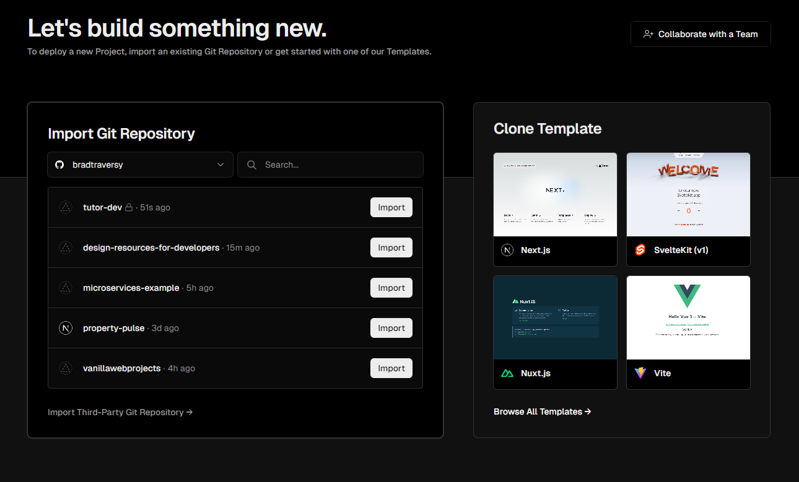
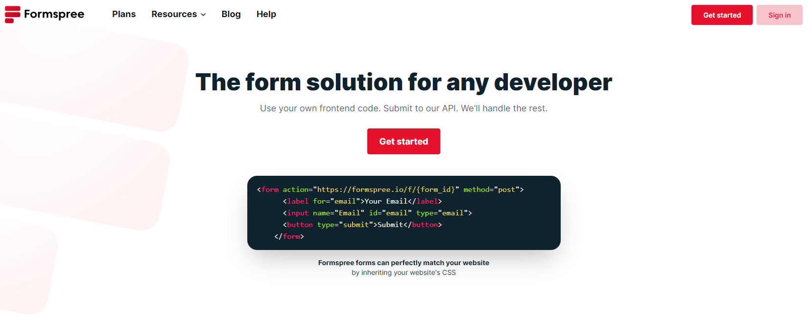
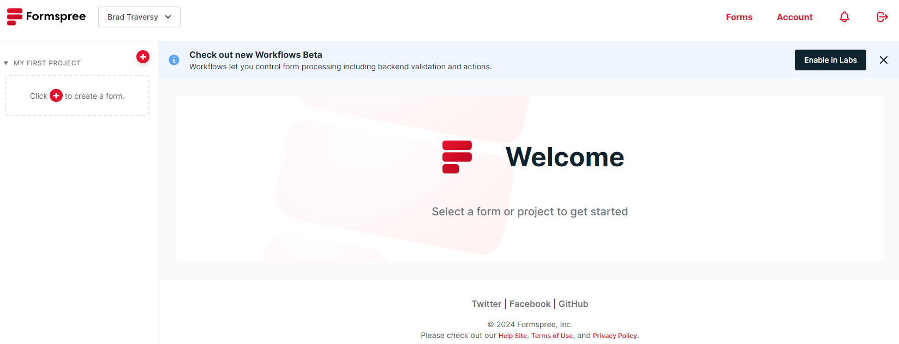
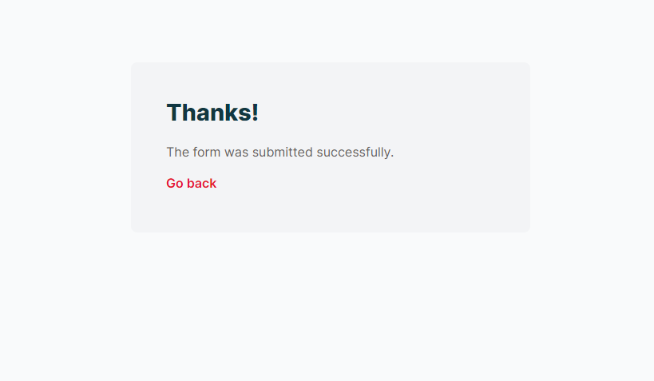

# Deployment With Vercel & FormSpree

Our Tutor website is now complete and ready for deployment. In this section, we'll deploy our website using Vercel and integrate FormSpree for the contact form.

## Push To Git

Before we deploy our website, we need to push our code to a Git repository. If you haven't initialized a Git repository yet, run the following commands:

```bash
git init
git add .
git commit -m "Initial commit"
```

Next, create a new repository on GitHub and push your code to the repository:

```bash
git remote add origin <repository-url>
git branch -M main
git push -u origin main
```

## Deploy With Vercel

Sign into Vercel with your Github account and click on the "Add New-> Project" button. Select your repository and click on the "Import" button.



Leave all of the defaults for the form and click on the "Deploy" button. Once the deployment is complete, you will see a success message with a link to your website.


Your site is now deployed and whenever you push new changes to your repository, Vercel will automatically deploy the changes.

## FormSpree Integration

To integrate FormSpree with our contact form, we need to create an account on [FormSpree](https://formspree.io/). Sign up with your email and verify your account.



When you log in, you will see a dashboard with your email address. Click on the "Create New Form" on the left.



Name it and put an email that you want to receive the form submissions. Click on the "Create Form" button.

## Form Endpoint

You will now see a page with an endpoint to submit your form to. That needs to be added to the form tag in the HTML file. You also need to add a name to all of your fields.

Change your form HTML to the following in your `contact.html` but replace `your-endpoint` with the endpoint provided by FormSpree:

```html
<form action="your-endpoint" method="POST">
  <input type="text" name="name" placeholder="Name" />
  <input type="email" name="email" placeholder="Email" />
  <textarea name="message" placeholder="Message"></textarea>
  <button type="submit" value="Send Message" class="btn">Send Message</button>
</form>
```

## Push Changes

After you have made the changes to your form, push the changes to your repository:

```bash
git add .
git commit -m "Add FormSpree integration"
git push
```

It may take a few minutes, but your production site will now have a working contact form that sends emails to your inbox.

You should see a thank you message.


