# Introduction

We are going to start our next project, which will be a website for a fictional mobile app called Leno. It is a productivity and health app. The content is not that important. What is really important is the structure and the design of the website. We are going to use a lot of CSS fundamentals such as Flexbox, Grid, and Media Queries. We are also going to use some JavaScript to make the website more interactive.

## BEM

We are going to use the BEM methodology to name our classes. BEM stands for Block, Element, Modifier. It is a naming convention for classes in HTML and CSS. It is a way to make your code more readable and easier to maintain. It is also a way to make your code more scalable and reusable. This is not something that you have to do, but I think it is worth learning so I wanted to include it in this course. I will talk more about BEM in the next lesson.

## Project Structure

The website will mostly consist of homepage content. We will have a navbar that will bring us to different sections of the website. Here are the main sections:

### 1. Navbar

The navbar will have a logo and a few links. The logo will be on the left and the links will be on the right. The links will be Home, Features, Details and Download. It will also have a hamburger menu for mobile devices. The menu will kick in when the screen is below 992px. We will also make it stick to the top and once we start to scroll, it will change the background from transparent to a dark purple. We will need to add a bit of JavaScript to make this happen.

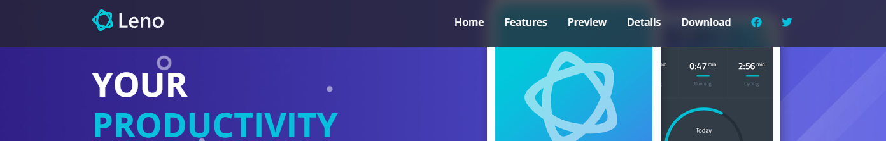

### 2. Hero

The hero will be in a `<header>` tage and will have the main text and buttons on the left and an image on the right. It will have a background gradient and image. It will use flexbox and be responsive.

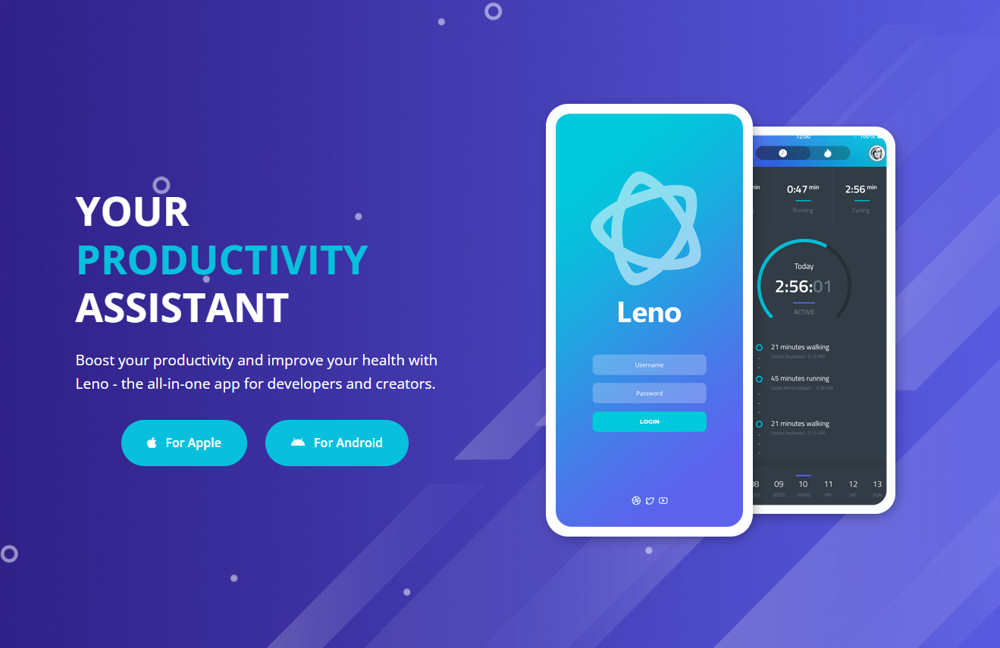

### 3. Testimonials

We will have 3 testimonials with an image, text and name. It will be responsive and use CSS Grid.

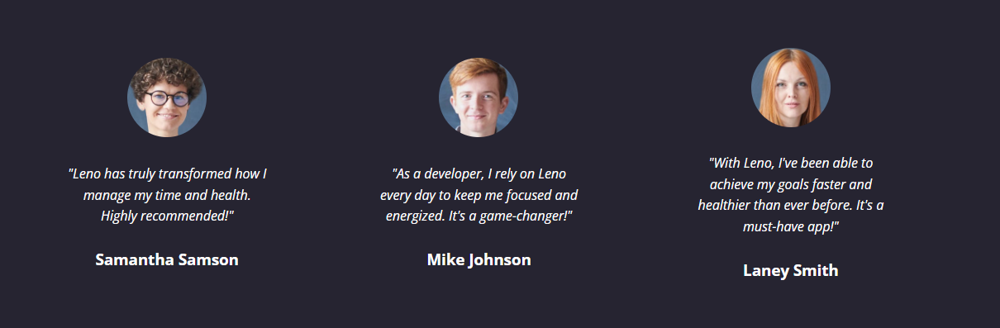

### 4. Features

Features will consist of a grid with 3 columns using the grid. The first and last column will be a list of icons and text that will use flexbox with a column layout. The middle column will be an image. The icons will come from Font Awesome. This section will probably be the most difficult to make responsive because the layout will change quite a bit on smaller screens.

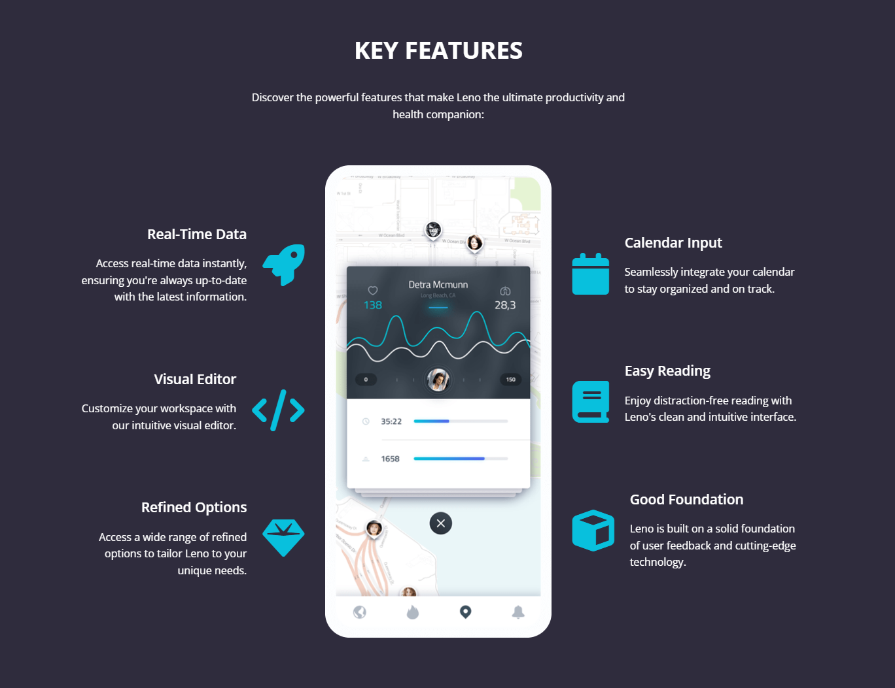

### 5. Preview

The preview section will have some text and a large image with an animated play button. We will be writing some advanced CSS to do the animation. We will also use some JavaScript to make the video play within a modal when the play button is clicked.

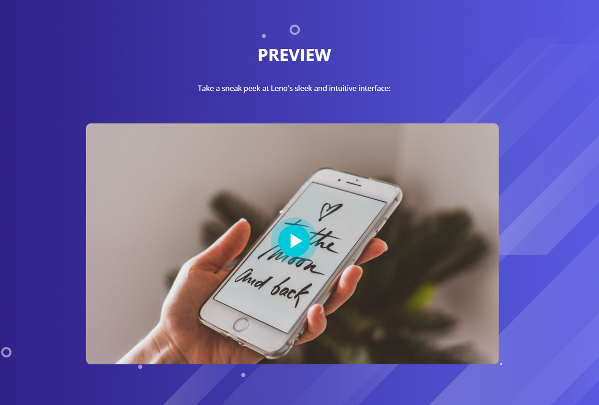

### 6. Details

The details section will consist of two rows with two columns. Both rows will have an image and text. The first row will have the image on the left and the text on the right. The second row will have the image on the right and the text on the left. It will also have some stats with icons at the bottom.

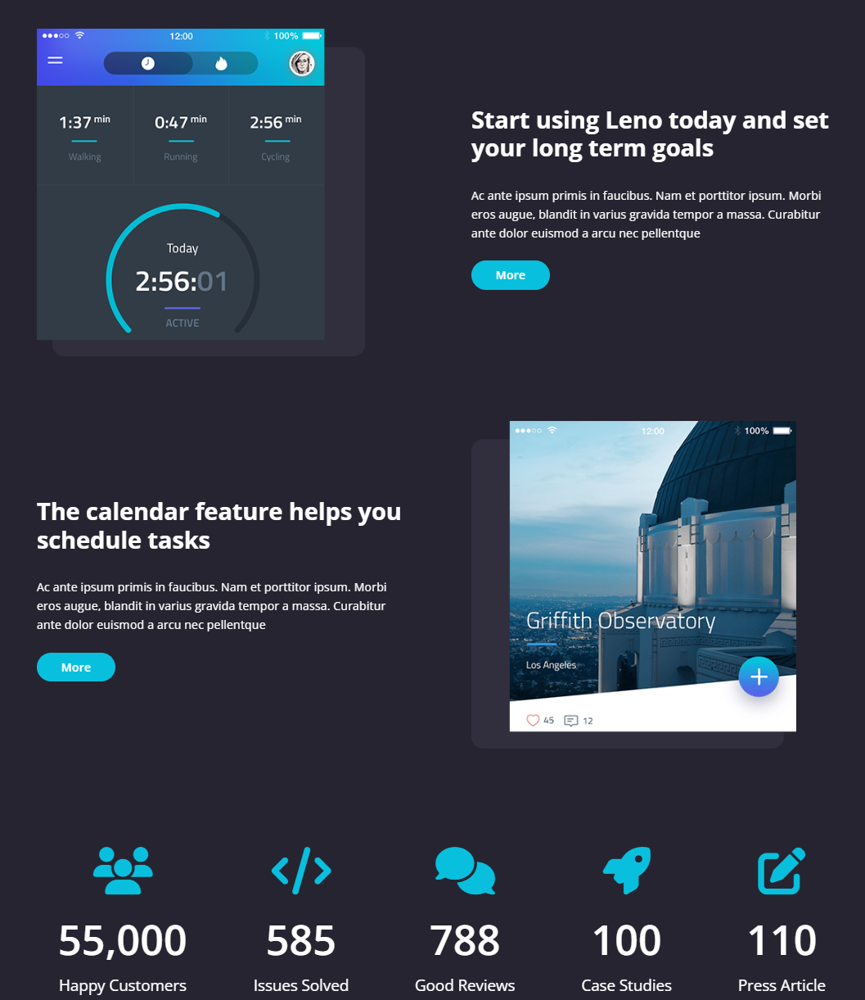

### 7. Screenshots

The screenshots section will have a bunch of screenshots in a row and will use flexbox with a flex wrap.

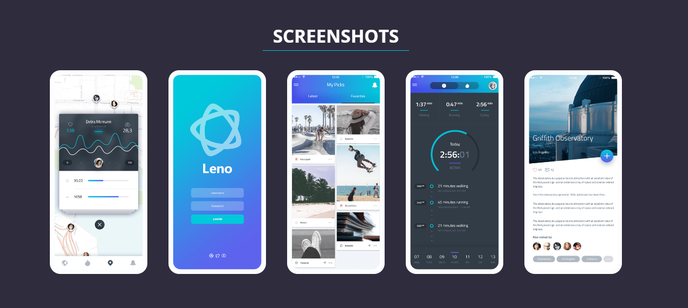

### 8. Download

The download section will have a large image on the right and some text and buttons on the left with a background image. It will be similar to the hero section.

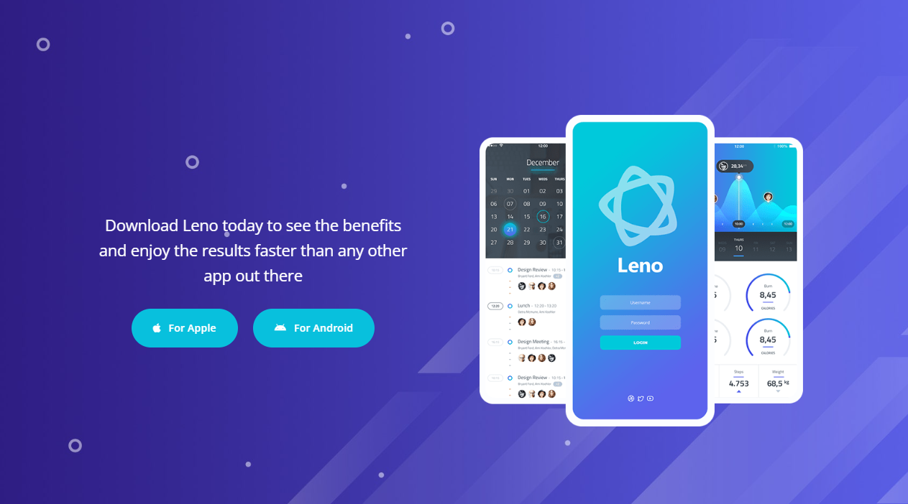

### 9. Footer

The footer will be simple. It will have a 3 columns. An about section, a links section and a social icons section. It will use the grid.

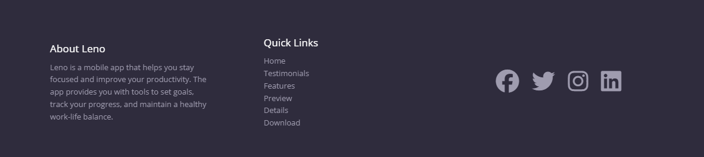

### Inner Details Page

We will have an inner details.html page with some pricing and features. The pricing will be a grid with 3 columns and the features will be a list.

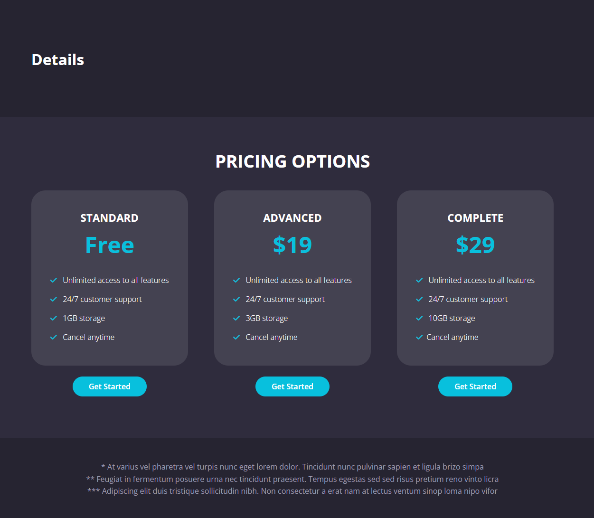

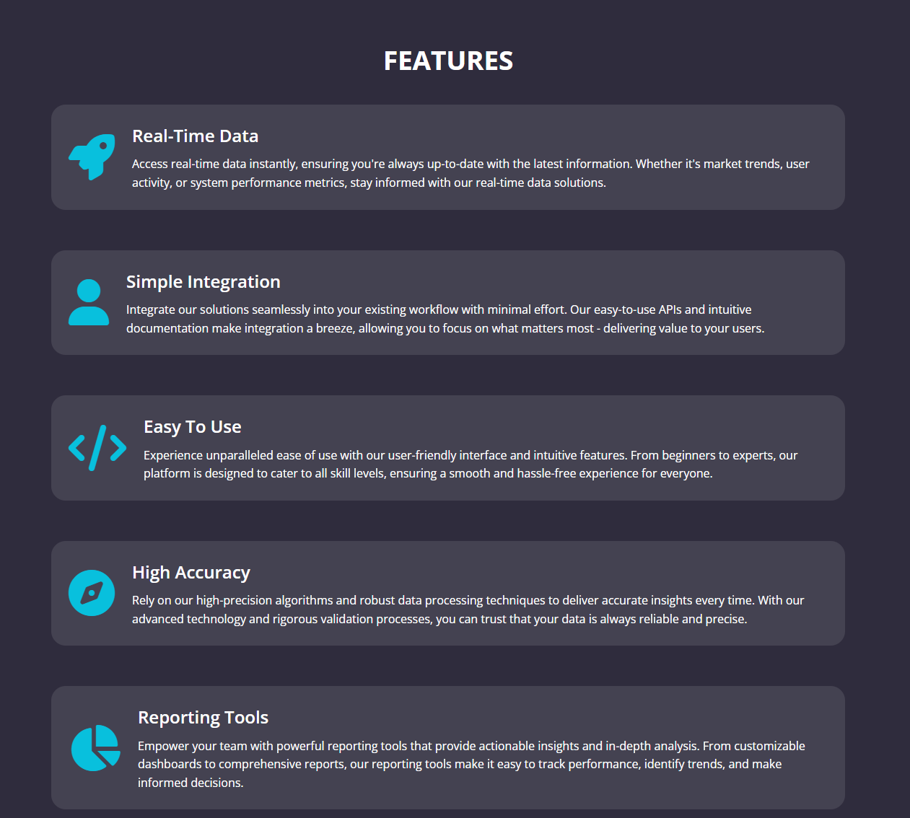

This is the structure of the website. We will start with the navbar and work our way down. We will also make the website responsive as we go. There will be some JavaScript, but it will be minimal. We will mostly focus on the structure and design of the website.
