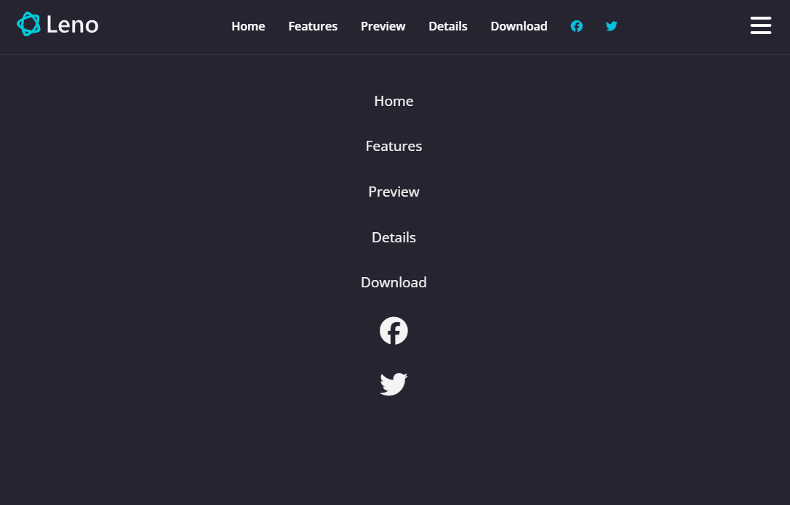

# Mobile Navigation

We have the desktop version of the navigation ready. Now let's work on the mobile version.

Here is the full code for the navbar including the mobile navigation:

```html
<!-- Navbar -->
<nav class="navbar">
  <div class="navbar__container">
    <div class="navbar__logo">
      
    </div>
    <div class="navbar__menu">
      <ul class="navbar__menu-list">
        <li class="navbar__menu-item">
          <a href="#home" class="navbar__menu-link">Home</a>
        </li>

        <li class="navbar__menu-item">
          <a href="#features" class="navbar__menu-link">Features</a>
        </li>
        <li class="navbar__menu-item">
          <a href="#preview" class="navbar__menu-link">Preview</a>
        </li>
        <li class="navbar__menu-item">
          <a href="#details" class="navbar__menu-link">Details</a>
        </li>
        <li class="navbar__menu-item">
          <a href="#download" class="navbar__menu-link">Download</a>
        </li>
        <li class="navbar__menu-item">
          <a href="#" class="navbar__menu-link navbar__menu-link--primary"
            ><i class="fa-brands fa-facebook"></i
          ></a>
        </li>
        <li class="navbar__menu-item">
          <a href="#" class="navbar__menu-link navbar__menu-link--primary"
            ><i class="fa-brands fa-twitter"></i
          ></a>
        </li>
      </ul>
    </div>
    <!-- New mobile menu block -->
    <div class="navbar__mobile-menu">
      <!-- Hamburger button -->
      <div class="navbar__mobile-menu-toggle">
        <i class="fas fa-bars fa-2x"></i>
      </div>
      <!-- Mobile menu items -->
      <div class="navbar__mobile-menu-items">
        <ul class="navbar__mobile-menu-list">
          <li class="navbar__mobile-menu-item">
            <a href="#home" class="navbar__mobile-menu-link">Home</a>
          </li>
          <li class="navbar__mobile-menu-item">
            <a href="#features" class="navbar__mobile-menu-link">Features</a>
          </li>
          <li class="navbar__mobile-menu-item">
            <a href="#preview" class="navbar__mobile-menu-link">Preview</a>
          </li>
          <li class="navbar__mobile-menu-item">
            <a href="#details" class="navbar__mobile-menu-link">Details</a>
          </li>
          <li class="navbar__menu-item">
            <a href="#download" class="navbar__mobile-menu-link">Download</a>
          </li>
          <li class="navbar__mobile-menu-item">
            <a
              href="#"
              class="navbar__mobile-menu-link navbar__mobile-menu-link--primary"
              ><i class="fa-brands fa-facebook fa-2x"></i
            ></a>
          </li>
          <li class="navbar__mobile-menu-item">
            <a
              href="#"
              class="navbar__mobile-menu-link navbar__mobile-menu-link--primary"
              ><i class="fa-brands fa-twitter fa-2x"></i
            ></a>
          </li>
        </ul>
      </div>
    </div>
  </div>
</nav>
```

At the moment, you will see both the desktop and mobile navigation. We will hide the mobile navigation by default and show it only when the user clicks on the hamburger button. Before we do that, let's style the mobile navigation.

## CSS

Add the following CSS to your `styles.css` file:

```css
/* Styling for the mobile menu items */
.navbar__mobile-menu-items {
  position: absolute;
  top: 100%;
  left: 0;
  width: 100%;
  background: var(--secondary-color);
  opacity: 0.95;
  padding: 3rem 2rem;
  text-align: center;
  box-shadow: 0 2px 5px rgba(0, 0, 0, 0.1);
  transition: transform 0.3s ease;
  border-top: 1px solid rgba(255, 255, 255, 0.1);
}

/* Styling for the mobile menu items list */
.navbar__mobile-menu-list {
  display: flex;
  flex-direction: column;
  gap: 2rem;
  font-size: 1.2rem;
}
```

We are positioning the mobile menu items absolutely and setting the background color to `var(--secondary-color)`. We are also adding some padding, a box shadow, and a border at the top. The `transition` property will help us animate the menu when it appears.

Then we are setting the mobile menu items list to a flex column layout with a gap of 2rem between the items.

We also need to add the hover effects to the text and social icons. Add the mobile class to the following in the CSS file:

```css
.navbar__menu-link:hover,
.navbar__mobile-menu-link:hover {
  color: var(--primary-color);
}

.navbar__menu-link--primary,
.navbar__mobile-menu-link--primary {
  color: var(--primary-color);
}

.navbar__menu-link--primary:hover,
.navbar__mobile-menu-link--primary:hover {
  color: #fff;
}
```

it should look like this:



We want to hide it by deault but we don't want to just set the display to none. We want it to slide in from the right. So let's position it off the screen to the right:

```css
/* Styling for the mobile menu items */
.navbar__mobile-menu-items {
  transform: translatex(100%); /* Hide the mobile menu items off screen */
  // Other styles
}
```

Now it should be hidden by default.

We also want to hide the desktop menu on smaller screens. We need to add a media query to hide the desktop menu and show the mobile menu when the screen size is less than 768px. I also want the navbar to have a dark background color on smaller screens. Add the following CSS to your `styles.css` file:

```css
/* Screens less than 768px */
@media screen and (max-width: 768px) {
  /* Navbar */
  .navbar {
    background: var(--secondary-color);
  }

  .navbar__menu {
    display: none; /* Hide the desktop menu on small screens */
  }
}
```

We also only want to show the hamburger button on smaller screens. So let's hide it on larger screens:

```css
.navbar__mobile-menu {
  display: none;
  cursor: pointer;
}
```

Now in the media query, add the following:

```css
/* Screens less than 768px */
@media screen and (max-width: 768px) {
  .navbar__menu {
    display: none; /* Hide the desktop menu on small screens */
  }

  .navbar__mobile-menu {
    display: block; /* Show the mobile menu on small screens */
  }

  .navbar__mobile-menu-toggle {
    display: block;
    padding: 10px;
  }
}
```

Now we want to make it so that the mobile menu will show when it has a class of `active`. Add the following CSS:

```css
/* Show the mobile menu when the hamburger button is clicked */
.navbar__mobile-menu-items.active {
  transform: translatex(0); /* Show the mobile menu items */
}
```

So we will change it from being off screen to being on screen when it has the class of `active`. You can manually add the class of `active` to the mobile menu items in the HTML to see it in action.

```html
<div class="navbar__mobile-menu-items active"></div>
```

Make sure you remove it when you are done testing.

#### JavaScript

Now we need to add some JavaScript to toggle the mobile menu when the hamburger button is clicked. Add the following JavaScript to your `scripts.js` file:

```js
document.addEventListener('DOMContentLoaded', function () {
  // Get hamburger button and mobile menu items
  const toggleButton = document.querySelector('.navbar__mobile-menu-toggle');
  const mobileMenu = document.querySelector('.navbar__mobile-menu-items');

  // Add click event listener to toggle mobile menu visibility
  toggleButton.addEventListener('click', function () {
    mobileMenu.classList.toggle('active');
  });
});
```

This code will add a click event listener to the hamburger button. When the button is clicked, it will toggle the `active` class on the mobile menu items, which will show or hide the mobile menu.

That's it! You now have a fully functional mobile navigation menu. Test it out by resizing your browser window to see the mobile menu in action.
