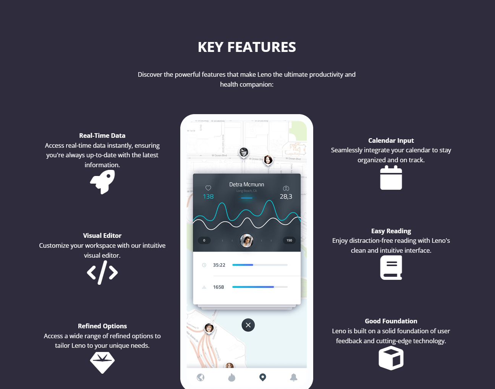

# Features Section

The features section is going to be a grid with 3 columns. The first column will be a list where each list item will have an icon and some text arranged in a flexbox. The second column will be a large image and the third column will be a list like the first one but we will align things differently. So there will be quite a bit of CSS, especially when it comes to responsive design.

Let's start by adding the HTML:

```html
 <!-- Features -->
    <section class="features" id="features">
      <div class="features__container container">
        <div class="features__content">
          <h2 class="features__title">Key Features</h2>
          <p class="features__description">
            Discover the powerful features that make Leno the ultimate
            productivity and health companion:
          </p>
          <div class="features__grid">
            <!-- Grid Column 1 -->
            <div class="features__grid-column features__grid-column-left">
              <!-- Grid Item 1 -->
              <div class="features__grid-item">
                <div class="features__grid-item-text">
                  <h4 class="features__grid-item-text-title">Real-Time Data</h4>
                  <p class="features__grid-item-text-description">
                    Access real-time data instantly, ensuring you're always
                    up-to-date with the latest information.
                  </p>
                </div>
                <div class="features__grid-item-icon">
                  <i class="fas fa-rocket fa-4x"></i>
                </div>
              </div>
              <!-- Grid Item 2 -->
              <div class="features__grid-item">
                <div class="features__grid-item-text">
                  <h4 class="features__grid-item-text-title">Visual Editor</h4>
                  <p class="features__grid-item-text-description">
                    Customize your workspace with our intuitive visual editor.
                  </p>
                </div>
                <div class="features__grid-item-icon">
                  <i class="fas fa-code fa-4x"></i>
                </div>
              </div>
              <!-- Grid Item 3 -->
              <div class="features__grid-item">
                <div class="features__grid-item-text">
                  <h4 class="features__grid-item-text-title">
                    Refined Options
                  </h4>
                  <p class="features__grid-item-text-description">
                    Access a wide range of refined options to tailor Leno to
                    your unique needs.
                  </p>
                </div>
                <div class="features__grid-item-icon">
                  <i class="fas fa-gem fa-4x"></i>
                </div>
              </div>
            </div>
            <!-- Grid Item 2 -->
            <div class="features__grid-column features__grid-column-center">
              
            </div>
            <!-- Grid Item 3 -->
            <div class="features__grid-column features__grid-column-right">
              <!-- Grid Item 1 -->
              <div class="features__grid-item">
                <div class="features__grid-item-text">
                  <h4 class="features__grid-item-text-title">Calendar Input</h4>
                  <p class="features__grid-item-text-description">
                    Seamlessly integrate your calendar to stay organized and on
                    track.
                  </p>
                </div>
                <div class="features__grid-item-icon">
                  <i class="fas fa-calendar fa-4x"></i>
                </div>
              </div>
              <!-- Grid Item 2 -->
              <div class="features__grid-item">
                <div class="features__grid-item-text">
                  <h4 class="features__grid-item-text-title">Easy Reading</h4>
                  <p class="features__grid-item-text-description">
                    Enjoy distraction-free reading with Leno's clean and
                    intuitive interface.
                  </p>
                </div>
                <div class="features__grid-item-icon">
                  <i class="fas fa-book fa-4x"></i>
                </div>
              </div>
              <!-- Grid Item 3 -->
              <div class="features__grid-item">
                <div class="features__grid-item-text">
                  <h4 class="features__grid-item-text-title">
                    Good Foundation
                  </h4>
                  <p class="features__grid-item-text-description">
                    Leno is built on a solid foundation of user feedback and
                    cutting-edge technology.
                  </p>
                </div>
                <div class="features__grid-item-icon">
                  <i class="fas fa-cube fa-4x"></i>
                </div>
              </div>
            </div>
          </div>
        </div>
      </div>
    </section>
```

As you can see, we have grid items and in the first and second grid items, we have list items.

Let's start by styling the section itself and the heading text at the top:

```css
/* Features */
.features {
  background: var(--tertiary-color);
  padding: 6rem 2rem;
}

.features__container {
  text-align: center;
}

.features__title {
  font-size: 2.3rem;
  margin-bottom: 2rem;
  text-transform: uppercase;
}

.features__description {
  max-width: 600px;
  margin: 1rem auto 4rem;
}
```

#### Features Grid

Now let's style the grid:

```css
.features__grid {
  display: grid;
  grid-template-columns: repeat(3, 1fr);
  gap: 2rem;
}

.features__grid-column {
  display: flex;
  flex-direction: column;
  align-items: center;
  justify-content: center;
  gap: 6rem;
}
```

So we should have 3 columns that look like this:



#### List Items

Now, let's style the list items:

```css
.features__grid-item {
  display: flex;
  gap: 1.5rem;
  align-items: start;
  justify-content: start;
  text-align: right;
}
```

Now the inner elements of the list items:

```css
.features__grid-item-text-title {
  font-size: 1.3rem;
  font-weight: 600;
  margin-bottom: 1rem;
}

.features__grid-item-icon {
  margin-top: 2rem;
}

.features__grid-item i {
  color: var(--primary-color);
}
```

The center image should be 100%:

```css
.features__grid-column-center img {
  width: 100%;
}
```

We want the right side item to be reversed so that the icon is on the left and the text is also aligned left:

```css
.features__grid-column-right .features__grid-item {
  flex-direction: row-reverse; /* Put icon on the left side */
  text-align: left;
}
```

We will make this responsive in the next lesson.
