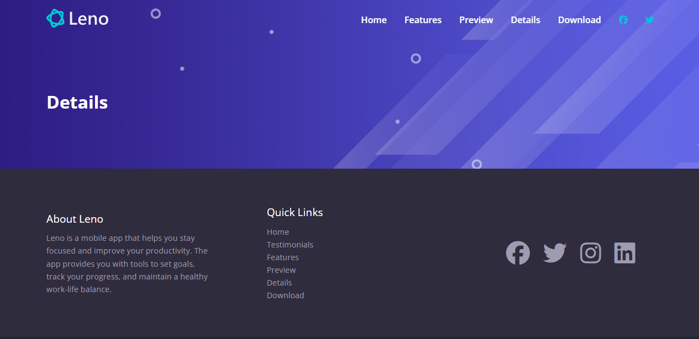

# Details Page & Header

We are done with the homepage, now we are going to create a details page with some pricing plans and some feature listings. In this lesson, we will create the page and add the inner header at the top.

We want the overall layout including the head, navbar and footer, so let's start by copying everything from the `index.html` page and create a new file called `details.html` and paste everything in it.

Once you do that, delete all of the sections except for the navbar and footer.

We also need to change the links to go to the `index.html` page.

It should look like this:

```html
<!DOCTYPE html>
<html lang="en">
  <head>
    <meta charset="UTF-8" />
    <meta name="viewport" content="width=device-width, initial-scale=1.0" />
    <link rel="preconnect" href="https://fonts.googleapis.com" />
    <link rel="preconnect" href="https://fonts.gstatic.com" crossorigin />
    <link
      href="https://fonts.googleapis.com/css2?family=Open+Sans:ital,wght@0,300..800;1,300..800&display=swap"
      rel="stylesheet"
    />
    <link
      rel="stylesheet"
      href="https://cdnjs.cloudflare.com/ajax/libs/font-awesome/6.5.1/css/all.min.css"
      integrity="sha512-DTOQO9RWCH3ppGqcWaEA1BIZOC6xxalwEsw9c2QQeAIftl+Vegovlnee1c9QX4TctnWMn13TZye+giMm8e2LwA=="
      crossorigin="anonymous"
      referrerpolicy="no-referrer"
    />
    <link rel="stylesheet" href="css/styles.css" />
    <link rel="icon" href="images/favicon.png" />
    <title>Leno App | Health & Productivity</title>
  </head>
  <body id="home">
    <!-- Navbar -->
    <nav class="navbar">
      <div class="navbar__container container">
        <div class="navbar__logo">
          
        </div>
        <div class="navbar__menu">
          <ul class="navbar__menu-list">
            <li class="navbar__menu-item">
              <a href="index.html" class="navbar__menu-link">Home</a>
            </li>

            <li class="navbar__menu-item">
              <a href="index.html#features" class="navbar__menu-link"
                >Features</a
              >
            </li>
            <li class="navbar__menu-item">
              <a href="index.html#preview" class="navbar__menu-link">Preview</a>
            </li>
            <li class="navbar__menu-item">
              <a href="index.html#details" class="navbar__menu-link">Details</a>
            </li>
            <li class="navbar__menu-item">
              <a href="index.html#download" class="navbar__menu-link"
                >Download</a
              >
            </li>
            <li class="navbar__menu-item">
              <a href="#" class="navbar__menu-link navbar__menu-link--primary"
                ><i class="fa-brands fa-facebook"></i
              ></a>
            </li>
            <li class="navbar__menu-item">
              <a href="#" class="navbar__menu-link navbar__menu-link--primary"
                ><i class="fa-brands fa-twitter"></i
              ></a>
            </li>
          </ul>
        </div>
        <!-- New mobile menu block -->
        <div class="navbar__mobile-menu">
          <!-- Hamburger button -->
          <div class="navbar__mobile-menu-toggle">
            <i class="fas fa-bars fa-2x"></i>
          </div>
          <!-- Mobile menu items -->
          <div class="navbar__mobile-menu-items">
            <ul class="navbar__mobile-menu-list">
              <li class="navbar__mobile-menu-item">
                <a href="index.html" class="navbar__mobile-menu-link">Home</a>
              </li>
              <li class="navbar__mobile-menu-item">
                <a href="index.html#features" class="navbar__mobile-menu-link"
                  >Features</a
                >
              </li>
              <li class="navbar__mobile-menu-item">
                <a href="index.html#preview" class="navbar__mobile-menu-link"
                  >Preview</a
                >
              </li>
              <li class="navbar__mobile-menu-item">
                <a href="index.html#details" class="navbar__mobile-menu-link"
                  >Details</a
                >
              </li>
              <li class="navbar__menu-item">
                <a href="index.html#download" class="navbar__mobile-menu-link"
                  >Download</a
                >
              </li>
              <li class="navbar__mobile-menu-item">
                <a
                  href="#"
                  class="navbar__mobile-menu-link navbar__mobile-menu-link--primary"
                  ><i class="fa-brands fa-facebook fa-2x"></i
                ></a>
              </li>
              <li class="navbar__mobile-menu-item">
                <a
                  href="#"
                  class="navbar__mobile-menu-link navbar__mobile-menu-link--primary"
                  ><i class="fa-brands fa-twitter fa-2x"></i
                ></a>
              </li>
            </ul>
          </div>
        </div>
      </div>
    </nav>

    <!-- Footer -->
    <footer class="footer">
      <div class="footer__container container">
        <div class="footer__about">
          <div class="footer__title">About Leno</div>
          <div class="footer__description">
            Leno is a mobile app that helps you stay focused and improve your
            productivity. The app provides you with tools to set goals, track
            your progress, and maintain a healthy work-life balance.
          </div>
        </div>
        <div class="footer__links">
          <div class="footer__title">Quick Links</div>
          <ul class="footer__links-list">
            <li class="footer__links-item">
              <a href="#home" class="footer__links-link">Home</a>
            </li>
            <li class="footer__links-item">
              <a href="#testimonials" class="footer__links-link"
                >Testimonials</a
              >
            </li>
            <li class="footer__links-item">
              <a href="#features" class="footer__links-link">Features</a>
            </li>
            <li class="footer__links-item">
              <a href="#preview" class="footer__links-link">Preview</a>
            </li>
            <li class="footer__links-item">
              <a href="#details" class="footer__links-link">Details</a>
            </li>
            <li class="footer__links-item">
              <a href="#download" class="footer__links-link">Download</a>
            </li>
          </ul>
        </div>
        <div class="footer__social">
          <a href="#" class="footer__social-link"
            ><i class="fa-brands fa-facebook fa-3x"></i
          ></a>
          <a href="#" class="footer__social-link"
            ><i class="fa-brands fa-twitter fa-3x"></i
          ></a>
          <a href="#" class="footer__social-link"
            ><i class="fa-brands fa-instagram fa-3x"></i>
          </a>
          <a href="#" class="footer__social-link"
            ><i class="fa-brands fa-linkedin fa-3x"></i>
          </a>
        </div>
      </div>
    </footer>

    <script src="js/script.js"></script>
  </body>
</html>
```

## Inner Header

Under the navbar, we will add a new section for the inner header. This will contain the title of the page. You would essentially do this for all inner pages.

```html
<!-- Inner Header -->
<header class="inner-header">
  <div class="inner-header__container container">
    <h1 class="inner-header__title">Details</h1>
  </div>
</header>
```

Now, let's add some CSS for the inner header:

```css
/* Inner Header */
.inner-header {
  padding: 10rem 2rem 6rem;
  background: linear-gradient(rgba(0, 0, 0, 0), rgba(0, 0, 0, 0)),
    url('../images/header-background.jpg') center center/cover no-repeat;
}
```

All we are doing is adding a background image to the header and centering the title. The padding is to give it some space from the top and bottom.

It should look like this:


